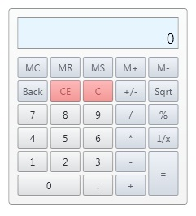

# Calculator
Derives from Control

The Calculator is a control used for performing mathematical calculations.

## Features
* Basic Math Functions
* Memory Operations
	* Clear
	* Store
	* Recall
	* Add (M+)
	* Subract (M-)
* Mouse and Keyboard support

## Properties
|| Property || Description
| CalculatorButtonPanelTemplate | Gets or sets the ControlTemplate of the Calculator buttons to define the wanted calculator buttons.
| CalculatorButtonType | Gets or sets the type of the calculator button (Add, Equal, Five, Six, Percent, ...). By default, None.
| DisplayText | Gets or sets the text displayed in the view port.
| EnterClosesCalculator | Gets or sets a value indicating whether the Enter keyboard button closes the calculator when pressed.
| Memory | Gets or sets the numeric value stored in memory
| Precision |  Gets or sets the maximum number of digits displayed to the right of the decimal point.
| Value | Gets or sets the numeric value.

## Events
|| Event || Description
| ValueChanged | Raised when the **Value** changes.

**Support this project, check out the [Plus Edition](https://xceed.com/xceed-toolkit-plus-for-wpf/).**
---