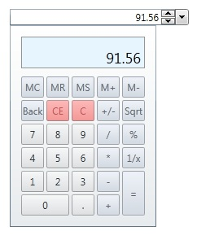
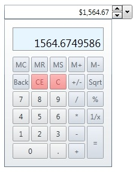

# CalculatorUpDown
Derives from Xceed.Wpf.Toolkit.DecimalUpDown

The CalculatorUpDown provides a TextBox with button spinners that allow incrementing and decrementing numeric values by using the spinner buttons, keyboard up/down arrows, or mouse wheel.  It also provides a [Calculator](Calculator) dropdown which allows you to perform mathematical calculations.

* [Usage](#usage)
* [Applying Format Strings](#formatstring)
* [Supported Format Strings](#supportedformatstring)
* [Watermark](#watermarks)
* [Properties/Events](#properties_events)

When using the CalculatorUpDown in data binding scenarios, bind your object's value to the **Value** property.  You can specify how much to increment the value by setting the **Increment** property.   You can control the minimum and maximum allowed values by setting the **Minimum** and the **Maximum** properties.  You can also specify if the user can directly edit the values in the text box by setting the **IsEditable** property.  If you would like to get the actual fromatted string representation of the value, you can use the **Text** property.

{anchor:formatstring}
## Applying FormatStrings

**Default:**

{{
     <xctk:CalculatorUpDown Value="1564.6749586" />}}

**Floating Point:**

{{
     <xctk:CalculatorUpDown FormatString="F3" Value="1564.6749586" Increment=".001"  Maximum="200000.599" />
}}

**Currency:**

{{
     <xctk:CalculatorUpDown FormatString="C2" Value="1564.6749586" Increment=".5" Maximum="5000.50" Minimum="50.01" />
}}

{anchor:supportedformatstring}
## Supported Format Strings

|| Format Specifier || Name
| C | Currency
| F | Fixed Point  
| G | General
| N | Number
| P | Percent  

{anchor:watermarks}
## Watermark
You can provide a **Watermark** to show text in place of a NULL **Value**.

{{
     <xctk:CalculatorUpDown Watermark="Enter Value" />
}}

{anchor:properties_events}
## Properties
|| Property || Description
| AllowSpin | Gets or sets the ability to perform increment/decrement operations via the keyboard, button spinners, or mouse wheel. (Inherited from UpDownBase)
| AllowTextInput | Determines if the editable part of the control can be edited. The editable part does not include buttons or spinners, it is typically the text part.
| AutoMoveFocus | Gets or sets if the focus can move from this control to other controls. (Inherited from NumericUpDown)
| AutoSelectBehavior | Gets or sets a value indicating how the content of the auto-select text box is selected (Never or OnFocus). By default, OnFocus. (Inherited from NumericUpDown)
| ClipValueToMinMax | Gets or sets if the value should be clipped when minimum/maximum is reached. (Inherited from UpDownBase)
| CultureInfo | Gets or sets the current CultureInfo. (Inherited from InputBase)
| DefaultValue | Get or sets the value to use when the **Value** is null and an increment/decrement operation is performed. (Inherited from UpDownBase)
| DisplayDefaultValueOnEmptyText | Gets or sets if the **DefaultValue** should be displayed when the text is empty. (Inherited from UpDownBase)
| DisplayText | Gets or sets the text displayed in the [Calculator](Calculator) view port.
| EnterClosesCalculator | Gets or sets whether or not the Enter keyboard button will close the [Calculator](Calculator) when pressed.
| FormatString | Gets or sets the dispaly format of the **Value**.
| Increment | Gets or Sets the amount in which to increment the value. (Inherited from NumericUpDown)
| IsOpen | Gets or sets if the Calculator is displayed.
| IsReadOnly | Gets or sets if the control is read only. (Inherited from InputBase)
| Maximum | Gets or sets the maximum allowed value. (Inherited from UpDownBase)
| Memory | Gets or sets the numeric value stored in the [Calculator](Calculator) memory.
| Mimum | Gets or sets the minimum allowed value. (Inherited from UpDownBase)
| MouseWheelActiveTrigger | Gets or sets when the MouseWheel is active (Focused, FocusedMouseOver, MouseOver, Disabled). By default, FocusedMouseOver. (Inherited from UpDownBase)
| ParsingNumberStyle | Gets or sets the parsing style (AllowLeadingWhite, Float, AllowHexSpecifier, ...). By default, Any. (Inherited from CommonNumericUpDown)
| Precision |  Gets or sets the maximum number of digits displayed to the right of the decimal point in the [Calculator](Calculator).
| ShowButtonSpinner | Gets or sets if the button spinners are visible. (Inherited from UpDownBase)
| Text | Gets or sets the formatted string representation of the value. (Inherited from InputBase)
| TextAlignment | Gets or sets the alignment of the **Text** (Left, Right, Center, Justify). By default, Left. (Inherited from InputBase)
| Value | Gets or sets the numeric value. (Inherited from UpDownBase)
| Watermark | Gets or sets the object to use as a watermark if the **Value** is null. (Inherited from InputBase)
| WatermarkTemplate | Gets or sets the DatTemplate to use for the **Watermark**. (Inherited from InputBase)

## Events
|| Event || Description
| InputValidationError | Raised when the **Text** cannot be converted to a valid **Value**. (Inherited from UpDownBase)
| ValueChanged | Raised when the **Value** changes. (Inherited from UpDownBase)

**Support this project, check out the [Plus Edition](https://xceed.com/xceed-toolkit-plus-for-wpf/).**
---