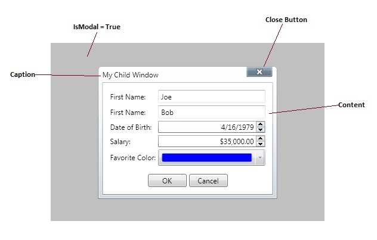

# ChildWindow
Derives from Xceed.Wpf.Toolkit.Primitives.WindowControl

Starting with version 2.0, ChildWindow (and MessageBox) is derived from WindowControl and no longer manages its parent’s background or the positioning of itself based on its parent’s size. The old version of ChildWindow will remain available, but obsolete.

A WindowContainer should now be used to contain these controls. It provides an area where WindowControl-derived controls (ChildWindow or MessageBox controls) can be displayed. This is particularly interesting in an XBAP application where windows can't be popped up. In this case the WindowContainer can be sized to fit the application and the window-like control can be moved around in the WindowContainer.

The WindowContainer derives from Canvas and positions its children according to its size. Many actions performed on its children are managed by the WindowContainer (movement and positioning, resizing, visibility, modal, and mouse click). This will restrict the WindowControl movements and resizing to the WindowContainer’s size.

When no Width and Height are specified in the WindowContainer, its DesiredSize will be the size of its biggest child.

Show the dialog by calling ChildWindow.Show or by setting the ChildWindow.WindowState property.

{{
<xctk:WindowContainer>
  <xctk:ChildWindow WindowBackground="Blue"
                    Left="75"
                    Top="50"
                    Width="275"
                    Height="125"
                    WindowState="Open">
    <TextBlock Text="This is a Child Window" Padding="10"/>
  </xctk:ChildWindow>

  <xctk:ChildWindow WindowBackground="Green"
                    Left="175"
                    Top="125"
                    Width="275"
                    Height="125"
                    WindowState="Open">
    <TextBlock Text="This is another Child Window" Padding="10"/>
  </xctk:ChildWindow>

  <xctk:MessageBox Caption="MessageBox"
                   Text="This is a MessageBox"/>
</xctk:WindowContainer>
}}

## Properties
|| Property || Description
| Caption | Gets or sets the caption of the ChildWindow. (Inherited from Xceed.Wpf.Toolkit.Primitives.WindowControl)
| CaptionForeground | Gets or sets the foreground color of the caption text. (Inherited from Xceed.Wpf.Toolkit.Primitives.WindowControl)
| CaptionIcon | Gets or sets the caption icon. (Inherited from Xceed.Wpf.Toolkit.Primitives.WindowControl)
| CaptionShadowBrush | Gets or sets the brush of the caption's shadow. (Inherited from Xceed.Wpf.Toolkit.Primitives.WindowControl)
| CloseButtonStyle | Gets or sets the style of the ChildWindow's close button. (Inherited from Xceed.Wpf.Toolkit.Primitives.WindowControl)
| CloseButtonVisibility | Gets or sets the visibility of the ChildWindow's close button. (Inherited from Xceed.Wpf.Toolkit.Primitives.WindowControl)
| DesignerWindowState | Gets or sets the state of the ChildWindow in the designer.  
| DialogResult | Gets or sets a value indicating whether the ChildWindow was accepted or canceled  
| FocusedElement | Gets or sets the FrameworkElement that currently has focus.  
| IsActive | Gets or sets whether the control is active. (Inherited from Xceed.Wpf.Toolkit.Primitives.WindowControl)
| IsModal | Gets or sets a value indicating whether the ChildWindow is modal.  
| Left | Gets or sets the left position of the ChildWindow. (Inherited from Xceed.Wpf.Toolkit.Primitives.WindowControl)
| Top | Gets or sets the top position of the ChildWindow. (Inherited from Xceed.Wpf.Toolkit.Primitives.WindowControl)
| WindowBackground | Gets or sets the background color of the ChildWindow. (Inherited from Xceed.Wpf.Toolkit.Primitives.WindowControl)
| WindowBorderBrush | Gets or sets the BorderBrush of the ChildWindow. (Inherited from Xceed.Wpf.Toolkit.Primitives.WindowControl)
| WindowBorderThickness | Gets or sets the window's border thickness. (Inherited from Xceed.Wpf.Toolkit.Primitives.WindowControl)
| WindowInactiveBackground | Gets or sets the window's inactive background. (Inherited from Xceed.Wpf.Toolkit.Primitives.WindowControl)
| WindowOpacity | Gets or sets the opacity of the ChildWindow. (Inherited from Xceed.Wpf.Toolkit.Primitives.WindowControl)
| WindowStartupLocation | Gets or sets the startup location of the ChildWindow.  
| WindowState | Gets or sets the current state of the ChildWindow.  
| WindowStyle | Gets or sets the window's style. (Inherited from Xceed.Wpf.Toolkit.Primitives.WindowControl)
| WindowThickness | Gets or sets the window's thickness. (Inherited from Xceed.Wpf.Toolkit.Primitives.WindowControl)

## Events
|| Event || Description
| CloseButtonClicked | Raised when the Close button is clicked. (Inherited from Xceed.Wpf.Toolkit.Primitives.WindowControl)
| Closed | Raised when the ChildWindow is closed.
| Closing | Raised when the ChildWindow is closing.
| HeaderDragDelta | Raised as the mouse changes position when a header has logical focus and mouse capture. (Inherited from Xceed.Wpf.Toolkit.Primitives.WindowControl)
| HeaderIconClicked | Raised when the header icon is clicked. (Inherited from Xceed.Wpf.Toolkit.Primitives.WindowControl)
| HeaderIconDoubleClicked | Raised when the header icon is double-clicked. (Inherited from Xceed.Wpf.Toolkit.Primitives.WindowControl)
| HeaderMouseLeftButtonClicked | Raised when the header is clicked using the left mouse button. (Inherited from Xceed.Wpf.Toolkit.Primitives.WindowControl)
| HeaderMouseLeftButtonDoubleClicked | Raised when the header is double-clicked using the left mouse button. (Inherited from Xceed.Wpf.Toolkit.Primitives.WindowControl)
| HeaderMouseRightButtonClicked | Raised when the header is clicked using the right mouse button. (Inherited from Xceed.Wpf.Toolkit.Primitives.WindowControl)

## Methods
|| Method || Description
| Close | Closes the ChildWindow and sets the WindowState to Closed.
| OnApplyTemplate | Overridden. Invoked whenever application code or internal processes call ApplyTemplate.
| Show | Shows the ChildWindow and sets the WindowState to Open.

**Support this project, check out the [Plus Edition](https://xceed.com/xceed-toolkit-plus-for-wpf/).**
---