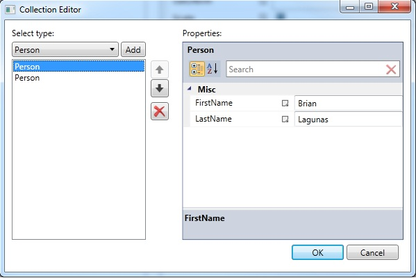

# CollectionEditorDialog
Provides a dialog containing a collection editor.

## Properties

|| Property || Description
| ItemsSource | Gets or sets a list used to generate the content of the CollectionEditor.
| ItemsSourceType | Gets or sets the type of ItemsSource.
| NewItemTypes  | Gets or sets a list of custom item types that appear in the Add comboBox.
