# Advanced DataGrid

The normal datagrid included in both the Community and Plus Edition of Extended WPF Toolkit is a rock-solid, high performance product with zero-lag data virtualization, the ability to handle large datasets, and with many core features. Xceed offers an advanced version of this datagrid with certain added features. You can purchase it separately, or try it for 45 days by clicking the 'Try it now' button [here](https://xceed.com/xceed-datagrid-for-wpf/), but it is also included in the [Xceed Business Suite for WPF](https://xceed.com/xceed-business-suite-for-wpf/) as well.

The advanced version of the DataGrid includes the following additional features:

* [Master / Detail View](#masterdetailview)
* [Tree Grid View](#treegridview)
* [Card View](#cardview)
* [3D View](#3dview)
* [Filter Row](#filterrow)
* [Insertion Row](#insertionrow)
* [Auto-filter Popup](#autofilterpopup)
* [Statistics Rows and Summary Rows](#statrows)
* [Print / Preview](#printpreview)
* [Exporting (CSV, Excel, etc.)](#exporting)
* [Column Chooser](#columnchooser)
* [Column Splitter Control](#columnsplittercontrol)
* [Persist User Settings](#persistusersettings)
* [Merged Column Headers](#mergedcolumnheaders) + dialog box for end-user to manage them
* [Design-time Support](#designtimesupport)
* [Excel-like Drag-to-Select Rows and Cells](#exceldragtoselect)
* [Asynchronous Binding Mode](#asyncbindingmode)
* [Flexible Row](#flexiblerow)
{anchor:masterdetailview}
## Master / Detail View

When a grid is in a table-view layout, its data items can display detail data that is usually provided by the detail descriptions defined in the DataGridCollectionView or DataGridCollectionViewSource to which the grid is bound. By default, detail descriptions are automatically created for most detail relation types; however, they can also be explicitly defined.

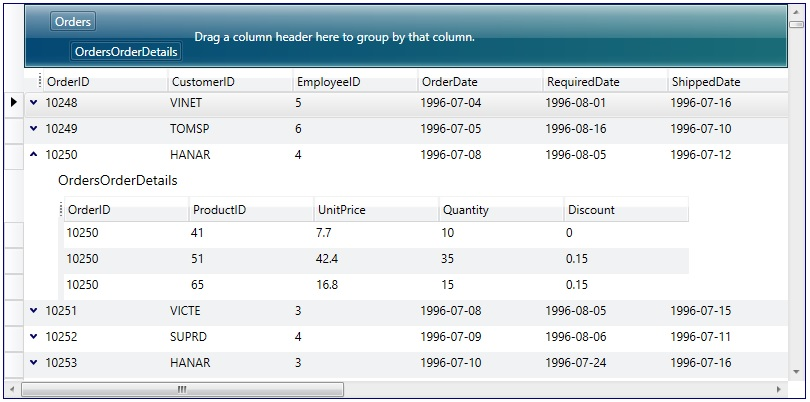
{anchor:treegridview}
## Tree Grid View

Represents a table-view layout similar to TableflowView, in which rows are laid out horizontally as in traditional grid-like styles, but detail columns are aligned with the columns of the master, and one column displays data using a tree-structure.

Like TableflowView, it provides animated smooth scrolling, sticky group headers and sticky master-detail master row and headers, full-column animated drag and drop reordering.

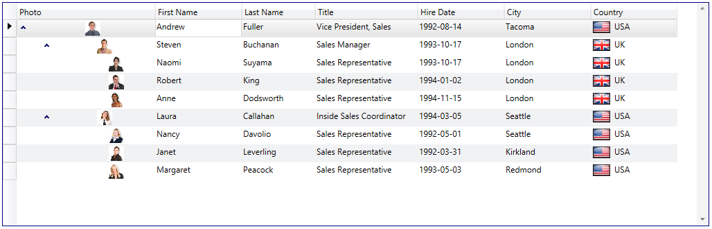
{anchor:cardview}
## Card View

The CardView and CompactCardView classes provide card-view layouts for the data items in a grid. Either layout can be used to display data items as cards; however, the compact card-view layout applies well when a database has many columns but few of the fields contain data. In this case, the fields that do not contain data will not be displayed in the cards, giving them a more compact appearance.

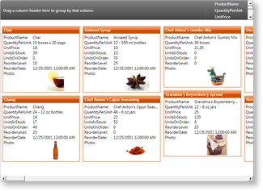
{anchor:3dview}
## 3D View

The Cardflow™ 3D view, which is represented by the CardflowView3D class, provides a 3-dimensional card-view layout for the data items in a grid and allows various card "surfaces" to display data using customized, theme-defined surface configurations.

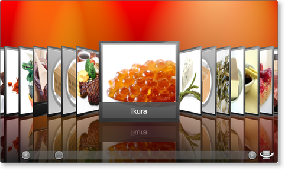
{anchor:filterrow}
## Filter Row

The FilterRow class represents a row in which values can be entered to filter the items in the corresponding columns. Custom type columns can also be filtered if they provide a TypeConverter (from string) and implement IComparable.

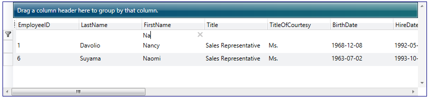
{anchor:insertionrow}
## Insertion Row

The InsertionRow class represents a row in which values can be entered to insert a new item to the grid.

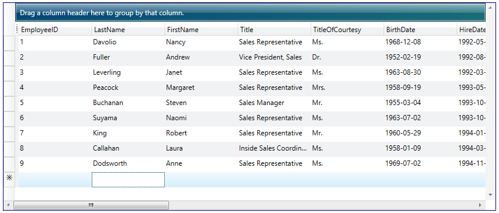
{anchor:autofilterpopup}
## Auto-filter Popup

In addition to the native CollectionView filtering, the DataGridCollectionView and DataGridDetailDescription classes also support automatic filtering, which provides Excel-like end-user filtering according to the distinct values of each column. Automatic filtering can be enabled by setting the AutoFilterMode property to And or Or (by default, None), indicating whether data items will be filtered according to all or at least one of the filtering criteria defined by each column's auto-filter control. The DistinctValuesConstraint property can also be set to determine if the distinct values are to be filtered according to the result of previous auto-filtering operations.

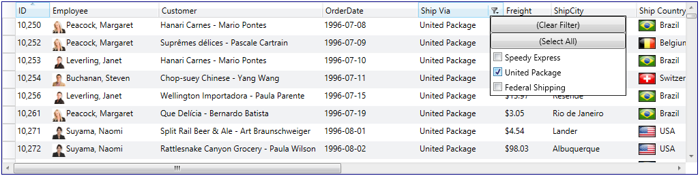
{anchor:statrows}
## Statistics Rows and Summary Rows

The StatRow class represents a row that can be used to display statistical results.

{anchor:printpreview}
## Print / Preview

The appearance of a grid when it is printed or exported is determined by the view assigned to a grid's PrintView property and the theme assigned to the view's Theme property. When a grid is printed using the default view and theme, the resulting pages will not have headers or footers and only a column-manager row will be contained in a grid's fixed-header section regardless of the configuration of the runtime grid.

The ShowPrintPreviewWindow and ShowPrintPreviewPopup methods provide print preview capabilities. ShowPrintPreviewPopup should be used when the application is being deployed as an XBAP, as XBAP applications cannot open new windows.
{anchor:exporting}
## Exporting (CSV, Excel, etc.)

Xceed DataGrid for WPF supports exporting to the XML spreadsheet format (xmlss). These files can be loaded in Excel 2002 and up as well as through the Microsoft Office XP Web Components Spreadsheet Component. The DataGrid also supports exporting to the CSV format, which is compatible with a wide variety of applications.

The DataGridControl class also exposes the ExportToXps method, which allows a grid to be exported as an XPS document.
{anchor:columnchooser}
## Column Chooser

The columns that are displayed in a grid can be chosen by the user through the column-chooser context menu, which can be enabled by setting the AllowColumnChooser defined on the view to true. A column's ShowInColumnChooser property determines whether a column's title is displayed in the menu, allowing its visibility to be manipulated by an end user. By default, the column-chooser context menu displays the titles of the columns in the same order as the they are positioned; however, through the ColumnChooserSortOrder property, the order can be changed to sort the titles alphabetically.

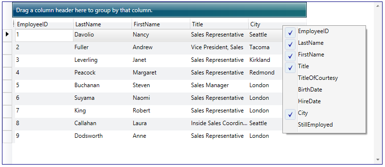

Instead of the default context menu style (shown above), the built-in dialog control can be used for a different look/behavior (shown below). A third option is to provide a custom look to the context menu.

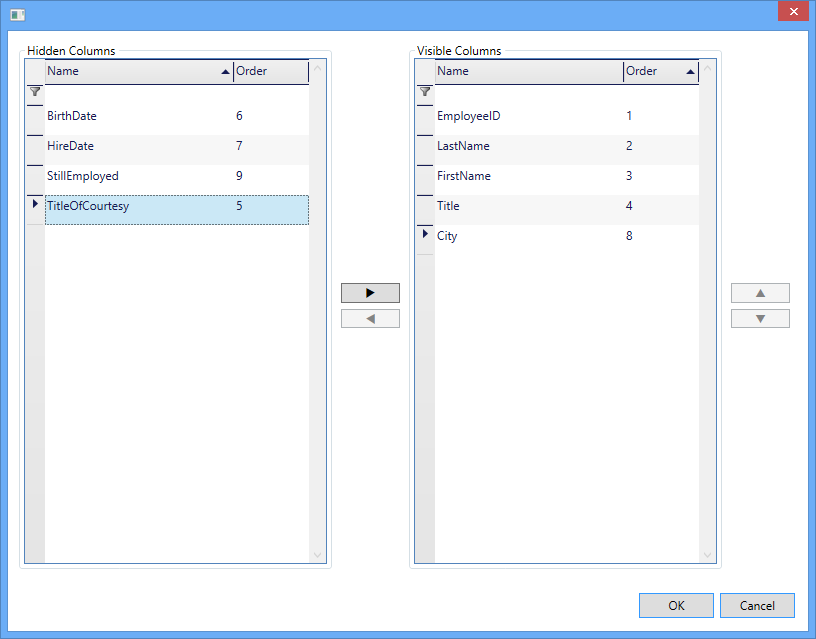
{anchor:columnsplittercontrol}
## Column Splitter Control

When a grid is in a table-view layout, the first n columns can be fixed so that they do not scroll with the grid content. Fixed columns are separated from their scrollable counterparts by a fixed-column splitter, which can be dragged to add or remove fixed columns. Likewise, column-manager cells can be dragged to the left or right of the fixed-column splitter to add or remove fixed columns. The appearance of the fixed-column splitter can be defined for each row type.

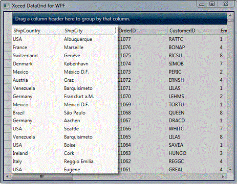
{anchor:persistusersettings}
## Persist User Settings

The settings of a grid and its elements can be persisted and re-applied using the SaveUserSettings and LoadUserSettings methods, respectively. By default, column widths, visibilities, positions, and fixed-column counts as well as grouping and sorting criteria are persisted; merged columns, their positions, and their visibilities can also be persisted. However, these settings can be modified when calling the SaveUserSettings and LoadUserSettings methods.

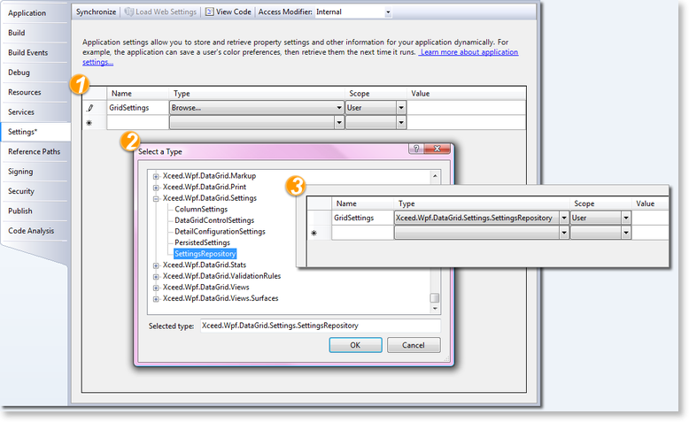
{anchor:mergedcolumnheaders}
## Merged Column Headers

Merged column headers can be used to present data more clearly and logically. They are displayed in the FixedHeaders section of a grid. Columns can be grouped ("merged") under these merged headers, as can other groups of columns. Merged headers and their columns can be moved (drag-and-drop, programmatically) and removed / added back.

{anchor:designtimesupport}
## Design-time Support

Xceed DataGrid for WPF provides design-time support for Visual Studio and Expression Blend. In Visual Studio, the DataGridControl control will appear in the toolbox under the Xceed tab and can be added to the design surface by double-clicking on the control or through drag and drop. It's properties can then be modified through the Visual Studio property grid or by using the Xceed DataGrid for WPF Configuration Window.

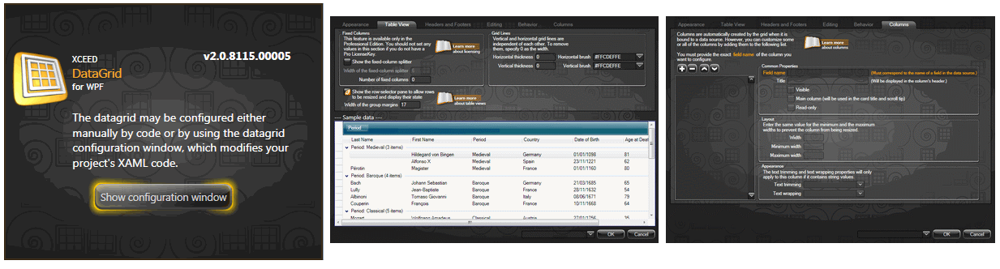
{anchor:exceldragtoselect}
## Excel-like Drag-to-Select Rows and Cells

The datagrid allows users to select multiple items or cells using Left-Click and then dragging the mouse within the datagrid. This allows range selection to be performed without having to hold the Shift key on the keyboard.

To activate this feature, set the DataGrid's AllowDrag property to true, and the DragBehavior property to "Select". The View must be a valid instance or subclass of TableView (ex. TableFlowView, TreeGridflowView).
{anchor:asyncbindingmode}
## Asynchronous Binding Mode

The IsAsync property can be used when the get accessor of your binding source property might take a long time. One example is an image property with a get accessor that downloads from the Web. Setting IsAsync to true avoids blocking the UI while the download occurs.

While waiting for the value to arrive, the binding reports the value set on the FallbackValue property, if one is available, or the default value of the binding target property.
{anchor:flexiblerow}
## Flexible Row

The FlexibleRow class represents a row that can be put inside any header or footer, and can display content that is not bound or related to the grid's data source.

---