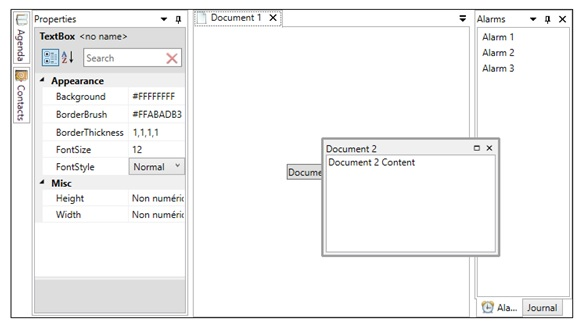

# AvalonDock (docking window control)

AvalonDock provides a system that allow developers to create customizable layouts using a window docking system similar to what is found in many popular integrated development environments (IDEs).

AvalonDock adheres to an MVVM design. The Model is represented by the classes contained in the Xceed.Wpf.AvalonDock.Layout namespace. The classes in this namespace are the layout elements in a layout model (for example LayoutAnchorable/LayoutDocument, LayoutAnchorablePane/LayoutDocumentPane, LayoutAnchorablePaneGroup/LayoutDocumentPaneGroup, etc.) that are used directly in XAML within a DockingManager to describe how the layout is composed.

* [DockingManager class](#dockingmanager_class)
* [Layout model classes](#layout_model_classes)

The following example shows how to set up various layout elements in a DockingManager.

{{
<local:DemoView x:Class="LiveExplorer.Samples.AvalonDock.Views.AvalonDockView"
                 xmlns="http://schemas.microsoft.com/winfx/2006/xaml/presentation"
                 xmlns:x="http://schemas.microsoft.com/winfx/2006/xaml"
                 xmlns:local="clr-namespace:LiveExplorer"
                 xmlns:xctk="http://schemas.xceed.com/wpf/xaml/toolkit"
                 xmlns:xcad="http://schemas.xceed.com/wpf/xaml/avalondock"
                 xmlns:s="clr-namespace:System;assembly=mscorlib">
   <Grid>
      <Grid.RowDefinitions>
         <RowDefinition Height="Auto" />
         <RowDefinition Height="*" />
      </Grid.RowDefinitions>

      <StackPanel Orientation="Horizontal" Margin="0,0,0,10">
         <TextBlock Text="Theme:" Margin="0,0,10,0" VerticalAlignment="Center"/>
         <ComboBox x:Name="_themeCombo" SelectedIndex="0" Width="200">
            <ComboBoxItem Content="Generic" />
            <ComboBoxItem Content="Aero">
               <ComboBoxItem.Tag>
                  <xcad:AeroTheme />
               </ComboBoxItem.Tag>
            </ComboBoxItem>
            <ComboBoxItem Content="VS2010">
               <ComboBoxItem.Tag>
                  <xcad:VS2010Theme />
               </ComboBoxItem.Tag>
            </ComboBoxItem>
            <ComboBoxItem Content="Metro">
               <ComboBoxItem.Tag>
                  <xcad:MetroTheme />
               </ComboBoxItem.Tag>
            </ComboBoxItem>
         </ComboBox>
      </StackPanel>

      <xcad:DockingManager Grid.Row="1" MaxHeight="425"
                           AllowMixedOrientation="True"
                           BorderBrush="Black"
                           BorderThickness="1"
                           Theme="{Binding ElementName=_themeCombo, Path=SelectedItem.Tag}">
         <xcad:DockingManager.DocumentHeaderTemplate>
            <DataTemplate>
               <StackPanel Orientation="Horizontal">
                  <Image Source="{Binding IconSource}" Margin="0,0,4,0"/>
                  <TextBlock Text="{Binding Title}" />
               </StackPanel>
            </DataTemplate>
         </xcad:DockingManager.DocumentHeaderTemplate>
         <xcad:LayoutRoot x:Name="_layoutRoot">
            <xcad:LayoutPanel Orientation="Horizontal">
               <xcad:LayoutAnchorablePane DockWidth="200">
                  <xcad:LayoutAnchorable ContentId="properties" Title="Properties" CanHide="False" CanClose="False"
                                            AutoHideWidth="240"
                                         IconSource="../Images/property-blue.png">
                     <xctk:PropertyGrid NameColumnWidth="110"
                        SelectedObject="{Binding ElementName=_layoutRoot, Path=LastFocusedDocument.Content}"/>
                  </xcad:LayoutAnchorable>
               </xcad:LayoutAnchorablePane>
               <xcad:LayoutDocumentPaneGroup >
                  <xcad:LayoutDocumentPane>
                     <xcad:LayoutDocument ContentId="document1" Title="Document 1" IconSource="../Images/document.png" >
                           <Button Content="Document 1 Content" HorizontalAlignment="Center" VerticalAlignment="Center"/>
                     </xcad:LayoutDocument>
                     <xcad:LayoutDocument ContentId="document2" Title="Document 2" IconSource="../Images/document.png">
                        <TextBox Text="Document 2 Content" AcceptsReturn="True"/>
                     </xcad:LayoutDocument>
                  </xcad:LayoutDocumentPane>
               </xcad:LayoutDocumentPaneGroup >
               <xcad:LayoutAnchorablePaneGroup DockWidth="125">
                  <xcad:LayoutAnchorablePane>
                     <xcad:LayoutAnchorable ContentId="alarms" Title="Alarms" IconSource="../Images/alarm-clock-blue.png" >
                        <ListBox>
                           <s:String>Alarm 1</s:String>
                           <s:String>Alarm 2</s:String>
                           <s:String>Alarm 3</s:String>
                        </ListBox>
                     </xcad:LayoutAnchorable>
                     <xcad:LayoutAnchorable ContentId="journal" Title="Journal" >
                        <RichTextBox>
                           <FlowDocument>
                              <Paragraph FontSize="14" FontFamily="Segoe">
                                 This is the content of the Journal Pane.
                                 <LineBreak/>
                                 A
                                 <Bold>RichTextBox</Bold> has been added here
                              </Paragraph>
                           </FlowDocument>
                        </RichTextBox>
                     </xcad:LayoutAnchorable>
                  </xcad:LayoutAnchorablePane>
               </xcad:LayoutAnchorablePaneGroup>
            </xcad:LayoutPanel>

            <xcad:LayoutRoot.LeftSide>
               <xcad:LayoutAnchorSide>
                  <xcad:LayoutAnchorGroup>
                     <xcad:LayoutAnchorable Title="Agenda" ContentId="agenda" IconSource="../Images/address-book-open.png">
                        <TextBlock Text="Agenda Content" Margin="10" FontSize="18" FontWeight="Black" TextWrapping="Wrap"/>
                     </xcad:LayoutAnchorable>
                     <xcad:LayoutAnchorable Title="Contacts" ContentId="contacts" IconSource="../Images/address-book--pencil.png" >
                        <TextBlock Text="Contacts Content" Margin="10" FontSize="18" FontWeight="Black" TextWrapping="Wrap"/>
                     </xcad:LayoutAnchorable>
                  </xcad:LayoutAnchorGroup>
               </xcad:LayoutAnchorSide>
            </xcad:LayoutRoot.LeftSide>
         </xcad:LayoutRoot>
      </xcad:DockingManager>
   </Grid>
</local:DemoView>
}}

The view is represented by the classes contained in the Xceed.Wpf.AvalonDock.Controls namespace; these classes are a set of stylizable controls that show the user controls. The names of the view controls typically end with "Control" and correspond to a layout model class (for example, LayoutAnchorableControl is the view control that corresponds to LayoutAnchorable, which is the model element).

The DockingManager, which is contained in the Xceed.Wpf.AvalonDock namespace, uses various classes (such as the LayoutItem and its derived classes) to perform the role of the ViewModel, preparing the model to be consumed by the view.

There is only one logical tree, which has the DockingManager as its root. Even if a control is placed in a different window (i.e., an autohidden window or a floating window), it always belong to the same logical tree below the DockingManager. 
{anchor:dockingmanager_class}
## The DockingManager class

The [DockingManager](DockingManager) class is the core control of AvalonDock. Its Layout property contains the layout composition that is represented by the classes in the Xceed.Wpf.AvalonDock.Layout namespace. The class arranges the panes it contains and also handles auto-hide windows and floating windows (panes in turn contain, directly or indirectly, the two types of "content" elements, namely, LayoutAnchorable and LayoutDocument elements). The DockingManager class also handles saving and restoring layouts.

Among other properties, the class provides several "Template" properties (e.g., AnchorableTitleTemplate/DocumentTitleTemplate, AnchorableHeaderTemplate/DocumentHeaderTemplate, etc.) that allow designers and developers to specify the template for the elements contained in the layout.
{anchor:layout_model_classes}
## Layout model classes

The layout element classes are used within the layout model held in the Layout property of the DockingManager. The fundamental content-containing classes in AvalonDock are [LayoutAnchorable](LayoutAnchorable) and [LayoutDocument](LayoutDocument); both of these classes derive from the [LayoutContent](LayoutContent) class, which determines whether an element can close, float (be dragged and transformed into a floating window), etc.

An anchorable is typically the container of application controls and can be dragged away from its container pane (LayoutAnchorablePane) and repositioned into another pane. Anchorables are always contained in a pane, which can be either a [LayoutAnchorablePane](LayoutAnchorablePane) or a [LayoutDocumentPane](LayoutDocumentPane), whereas documents (class LayoutDocument) can only be contained in a LayoutDocumentPane. Anchorables can also be dragged to a border of the parent DockingManager, which causes them to appear above, below, to the left of, or to the right of all other anchorables or documents (except for autohide windows; see the LayoutAnchorSide / LayoutAnchorGroup section below for details). Anchorables can also be left in a floating state (LayoutAnchorableFloatingWindow). Unlike documents, anchorables can autohide, where their content collapses to one side of the docking manager and is represented only by a tab (see LayoutAnchorSide and LayoutAnchorGroup). 

A document (LayoutDocument class) can be hosted only in a LayoutDocumentPane. This contrasts with the behavior of LayoutAnchorable, which can be hosted both in a LayoutDocumentPane and a LayoutAnchorablePane. Also, unlike anchorables, documents can't be anchored to a DockingManager border and can't be autohidden: they can only be positioned into a LayoutDocumentPane or floated in a LayoutDocumentFloatingWindow.

A [LayoutAnchorableFloatingWindow](LayoutAnchorableFloatingWindow) or a [LayoutDocumentFloatingWindow](LayoutDocumentFloatingWindow) is created automatically when the end-user drags an anchorable over the DockingManager. Floating windows can also be created programmatically using the Float method).

LayoutContent-derived elements (LayoutAnchorable and LayoutDocument) are typically arranged as in a tab control. A LayoutAnchorablePane can be set to autohide and can be dragged over the DockingManager as floating window. A LayoutAnchorablePane can also be anchored to a border of the parent DockingManager (see LayoutAnchorSide for more details).

Unlike a LayoutAnchorablePane, a LayoutDocumentPane cannot be set to autohide or dragged over the DockingManager as floating window (although individual LayoutDocument elements can be floated). A LayoutDocumentPane also can't be anchored to a border of the parent DockingManager. 

A [LayoutPanel](LayoutPanel) can also contain "pane group" elements (i.e., [LayoutAnchorablePaneGroup](LayoutAnchorablePaneGroup) or [LayoutDocumentPaneGroup](LayoutDocumentPaneGroup)), which group child panes together and allow various characteristics to be determined, such as the initial width/height the docked group occupies, the initial width/height of floating windows created from content dragged from them, and the orientation of the panes in the group (which is independent of the orientation of the LayoutPanel). LayoutAnchorablePaneGroup represents an element in the layout model that can contain and arrange multiple LayoutAnchorablePane elements, which in turn contain LayoutAnchorable elements. LayoutDocumentPaneGroup represents an element in the layout model that can contain and organize multiple LayoutDocumentPane elements, which in turn contain LayoutDocument elements. The "pane group" classes are primarily used to determine the orientation of the panes they contain.

[LayoutRoot](LayoutRoot) represents the root of the layout model. The Layout property of DockingManager is set to an instance of this class.

The RootPanel property of the LayoutRoot class is set to an instance of the LayoutPanel class.

A LayoutPanel can contain child panes directly (that is, LayoutAnchorablePane and LayoutDocumentPane). Panes in turn contain the actual content (that is, LayoutAnchorable or LayoutDocument elements, both of which derive from LayoutContent). A LayoutPanel can also contain "pane group" instances (i.e., LayoutAnchorablePaneGroup or LayoutDocumentPaneGroup), which group child panes together and allow various characteristics to be determined, such as the initial width/height the docked group occupies, the initial width/height of floating windows created from content dragged from them, and the orientation of the panes in the group (which is independent of the orientation of the LayoutPanel).

The LayoutRoot class provides four "Side" properties (e.g., LeftSide), which are used in conjunction with the LayoutAnchorSide and the LayoutAnchorGroup classes to set up autohide LayoutAnchorable elements along the border of the containing DockingManager. These elements are initially collapsed to the side to which they are anchored, displaying only a tab, and the "pin" glyph is pointing to the left. If the pin glyph of an autohide anchorable is clicked so that the pin is pointing down, the anchorable is no longer remains visible. Only LayoutAnchorable elements can be autohidden.

[LayoutAnchorGroup](LayoutAnchorGroup) represents an autohidden group of one or more LayoutAnchorable elements that can be anchored to one of the four sides of the DockingManager. To use LayoutAnchorGroup, add LayoutAnchorable elements to it, and add the resulting LayoutAnchorGroup to an instance of LayoutAnchorSide. The resulting LayoutAnchorSide is then assigned to a "Side" property (e.g., LeftSide, TopSide) of the LayoutRoot object held in the Layout property of DockingManager.

[LayoutAnchorSide](LayoutAnchorSide) represents a "side" in a DockingManager. To use LayoutAnchorSide, add LayoutAnchorable elements to a LayoutAnchorGroup, and add the resulting LayoutAnchorGroup to an instance of LayoutAnchorSide. The resulting LayoutAnchorSide is then assigned to a "Side" property (e.g., LeftSide, TopSide) of the LayoutRoot object held in the Layout property of DockingManager.

Note: You can find complete documentation of the API [here](http://doc.xceedsoft.com/products/XceedWpfToolkit/). See the 'Live Explorer' application with source code that demonstrates the features of this class and others [here](http://wpftoolkit.com/try-it/).

**Support this project, check out the [Plus Edition](https://xceed.com/xceed-toolkit-plus-for-wpf/).**
---