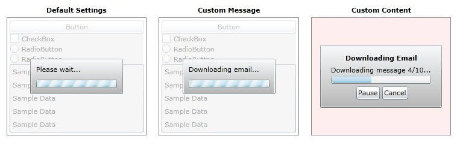

# BusyIndicator
Derives from ContentControl

BusyIndicator makes it easy to let the user know when an application is busy.  Simply wrap the relevant content in an instance of the BusyIndicator control and toggle its IsBusy property to True during any long-running process.

## Usage

**Add namespace:**
{{
xmlns:xctk="http://schemas.xceed.com/wpf/xaml/toolkit"
}}
**Default Settings:**
{{
<xctk:BusyIndicator IsBusy="True" >
            <ContentControl Style="{StaticResource SampleContent}"/>
</xctk:BusyIndicator>
}}
**Custom Message:**
{{
<xctk:BusyIndicator IsBusy="True" BusyContent="Downloading email..." >
            <ContentControl Style="{StaticResource SampleContent}"/>
</xctk:BusyIndicator>
}}
**Custom Content:**
{{
 <xctk:BusyIndicator IsBusy="True" DisplayAfter="0">
       <xctk:BusyIndicator.BusyContentTemplate>
            <DataTemplate>
                 <StackPanel Margin="4">
                          <TextBlock Text="Downloading Email" FontWeight="Bold" HorizontalAlignment="Center"/>
                           <StackPanel Margin="4">
                               <TextBlock Text="Downloading message 4/10..."/>
                               <ProgressBar Value="40" Height="15"/>
                           </StackPanel>
                           <Grid>
                               <Grid.ColumnDefinitions>
                                   <ColumnDefinition/>
                                   <ColumnDefinition/>
                               </Grid.ColumnDefinitions>
                               <Button Grid.Column="0" Content="Pause" HorizontalAlignment="Right" Margin="0 0 2 0"/>
                               <Button Grid.Column="1" Content="Cancel" HorizontalAlignment="Left" Margin="2 0 0 0"/>
                           </Grid>
                  </StackPanel>
            </DataTemplate>
       </xctk:BusyIndicator.BusyContentTemplate>
       <xctk:BusyIndicator.OverlayStyle>
                  
       </xctk:BusyIndicator.OverlayStyle>
       <xctk:BusyIndicator.ProgressBarStyle>
                   
       </xctk:BusyIndicator.ProgressBarStyle>
       <ContentControl Style="{StaticResource SampleContent}"/>
</xctk:BusyIndicator>
}}
## Properties
|| Property || Description
| BusyContent |  Gets or sets the busy content to display to the user.
| BusyContentTemplate | Gets or sets the DataTemplate to use for displaying the busy content to the user.
| DisplayAfter | Gets or sets the time interval that the busy content is delayed before being displayed.
| FocusAfterBusy | Gets or sets a control that should get focus when the busy indicator disappears.
| IsBusy |  Gets or sets a value indicating whether the busy indicator should be shown. 
| IsContentVisible | Gets or sets a value indicating whether the BusyContent is visible.
| OverlayStyle | Gets or sets a Style object representing the style to use for the overlay. By default, null.
| ProgressBarStyle | Gets or sets a Style object representing the style to use for the progress bar. By default, null.

Here is a blog post describing how to use the BusyIndicator in multi-threaded scenarios:

[http://elegantcode.com/2011/10/07/extended-wpf-toolkitusing-the-busyindicator/](http://elegantcode.com/2011/10/07/extended-wpf-toolkitusing-the-busyindicator/)

**Support this project, check out the [Plus Edition](https://xceed.com/xceed-toolkit-plus-for-wpf/).**
---