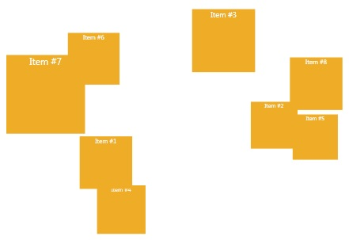

# CameraPanel
_Only available in the Plus Edition_

Derives from AnimationPanel

CameraPanel lays out its children in a 3D-like space. You can give the children a 3D location and set the camera position for the panel.

## Properties
|| Property || Description
| * | All the Properties from [Canvas](Canvas) Panel
| Depth (attached) | Gets or sets the Depth property.
| CameraX | Gets or sets the camera's X or left value.
| CameraY | Gets or sets the camera's Y or top value.
| CameraZ | Gets or sets the camera's Z or depth value.
| Left (attached) | Gets or sets the Left property.
| Top (attached) | Gets or sets the Top property.
| ZScaleFactor | Gets or sets the ZScaleFactor value.

## Events
|| Event || Description
| * | All the Events from [Canvas](Canvas) Panel.
---