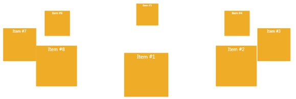

# Carousel
_Only available in the Plus Edition_

Derives from AnimationPanel

Positions the elements in a carousel mode with a centered element in front.

## Properties
|| Property || Description
| * | All the Properties from [Canvas](Canvas) Panel
| AngularOffset | Gets or sets the rotation on the carousel from the children.
| AngularExtend | Gets or sets the extension of the carousel (360 is a perfect circle).
| AreChildrenScaled | Gets or sets if the children in the back are smaller than the ones in the front.
| AreChildrenOrdered | Gets or sets is the children are ordered in the carousel.
| CenteredChild | Gets the center child in the carousel.
| DistantChildScale | Gets or sets the children scale for non-centered children.
| MaximumAngularSeparation | Gets or sets the maximum angle between children.
| MaximumRadius | Gets or sets the maximum radius in the carousel.
| MinimumAngularSeparation | Gets or sets the minimum angle between children.
| MinimumRadius | Gets or sets the minimum radius in the carousel.
| Orientation | Gets or sets the orientation of the carousel (Vertical or Horizontal).
| Radius | Gets the radius in the carousel.
| Tilt | Gets or sets the tilt angle of the carousel.

## Events
|| Event || Description
| * | All the Events from [Canvas](Canvas) Panel.

## Methods
|| Method || Description
| CenterChild( UIElement child, TimeSpan animationDuration, bool perQuarterTurn ) | Moves child to the front center of the carousel.
| ReorderChildrenAroundChild( UIElement child ) | This function will reorder the children inside the panel based on the given child.
| StopAnimation() | Stop any active animation.
| GetChildOffset( DependencyObject d ) | Gets the ChildOffset property.
| SetChildOffset( DependencyObject d, double value ) | sets the ChildOffset property.
| GetChildScale( DependencyObject d ) | Gets the ChildScale property.
| SetChildScale( DependencyObject d, double value ) | Sets the ChildScale property.
| GetChildZIndex( DependencyObject d ) | Gets or sets the ChildZIndex property. 
| SetChildZIndex( DependencyObject d, int value ) | sets the ChildZIndex property.
---