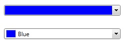
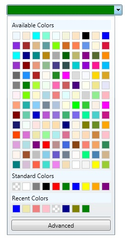
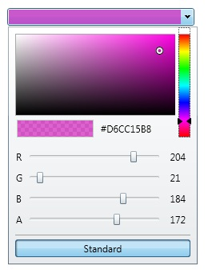

# ColorPicker
Derives from Control

The ColorPicker is an editor that allows a user to pick a color from predefind color palettes.  By default, there are 140 available colors and 10 predefined standard colors.  You can use your own custom color palettes by setting the AvailableColors and StandardColors properties accordingly.  You can also get/set the recently used colors by using the RecentColors property.

**Display** (DisplayColorAndName = true/false)

**Expanded Standard**

**Expanded Advanced**

## Properties
|| Property || Description
| AdvancedButtonHeader | Gets or sets a value representing the text to use for the "Advanced" button in the ColorPicker's popup.  
| AvailableColors | Gets or sets all colors that are available to the user for selection.
| AvailableColorsHeader | Gets or sets the header text of the Available Colors section.
| AvailableColorSortingMode | Gets or sets the way the Available colors are sorted (Alphabetical or by HueSaturationBrightness). By default, Alphabetical.
| ButtonStyle | Gets or sets the dropdown button style.
| ColorMode | Gets or sets the current display of the ColorPicker (ColorPalette or ColorCanvas). By default, ColorPalette.
| DisplayColorAndName | Gets or sets a value indicating if the control should display the color, or the color and color name.
| IsOpen | Gets or sets the value indicating if the color dropdown is open.
| RecentColors | Gets or sets all the recently selected colors.
| RecentColorsHeader | Gets or sets the header text of the Recent Colors section.
| SelectedColor | Gets or sets the currently selected color.
| SelectedColorText | Gets the known color name, or the color hexadecimal string of the **SelectedColor**.
| ShowAdvancedButton | Gets or sets the visibility of the Advance color mode button.
| ShowAvailableColors | Gets or sets the visibility of the **AvailableColors**.
| ShowDropDownButton | Gets or sets a value indicating whether the dropdown button is shown.
| ShowRecentColors | Gets or sets the visibility of the **RecentColors** (false by default).
| ShowStandardColors | Gets or sets the visibility of the **StandardColors**.
| StandardButtonHeader | Gets or sets the text to use for the "Standard" button in the ColorPicker's popup.  
| StandardColors | Gets or sets a standard color palette.
| StandardColorsHeader | Gets or sets the header text of the Standard Colors section.
| UsingAlphaChannel | Gets a value indicating whether the alpha channel is being used.

## Events
|| Event || Description
| SelectedColorChanged | Raised when the **SelectedColor** value changes.

**Support this project, check out the [Plus Edition](https://xceed.com/xceed-toolkit-plus-for-wpf/).**
---