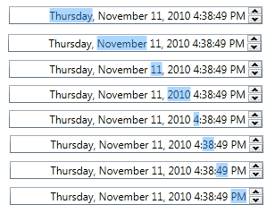
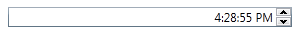
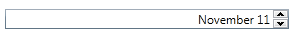
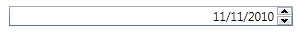
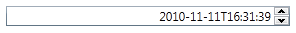
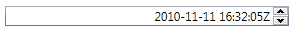

# DateTimeUpDown
Derives from Xceed.Wpf.Toolkit.Core.Primitives.DateTimeUpDownBase

The DateTimeUpDown control allows a user to increment or decrement a DateTime using button spinners, up/down keys, or the mouse wheel.

## Usage
To use the DateTimeUpDown control simply create an instance of the control in your XAML file, specify the DateTimeUpDown.Value property, and select a Format by setting the DateTimeUpDown.Format property.

{{
<xctk:DateTimeUpDown Value="{Binding LastUpdated}" Format="FullDateTime" />
}}

## Modifying the DateTime Value
To increment or decrement the DateTime value, simply select the DateTime part you wish to modify and then interact with either the mouse wheel, spinner buttons, or updown arrow keys.  The following image shows what the different DateTime parts look like when you select them.

Depending on your DateTimeUpDown.Format, you may or maynot have all DateTime parts available.  You can also get the formatted DateTimeUpDown.Value by using the DateTimeUpDown.Text property.

## Formats

|| Format | Example
| FullDateTime | 
| LongDate | 
| LongTime | 
| MonthDay | 
| RFC1123 | 
| ShortDate | 
| ShortTime | 
| SortableDateTime | 
| UniversalSortableDateTime | 
| YearMonth | 

## Custom Format

If the available formats don't fit you rneeds you can create your own custom format.  Simply specfiy the Format property as Custom and then provide a FormatString.

{{
<extToolkit:DateTimeUpDown Format="Custom" FormatString="hh:mm tt" Value="13:30" />
}}

## Properties
|| Property || Description
| AllowSpin | Gets or sets the ability to perform increment/decrement operations via the keyboard, button spinners, or mouse wheel. (Inherited from UpDownBase<T>)
| AllowTextInput | Determines if the editable part of the control can be edited. The editable part does not include buttons or spinners, it is typically the text part.
| ClipValueToMinMax | Gets or sets if the value should be clipped when minimum/maximum is reached. (Inherited from UpDownBase)
| CultureInfo | Gets or sets the current CultureInfo. (Inherited from InputBase)
| DefaultValue | Get or sets the value to use when the **Value** is null and an increment/decrement operation is performed. (Inherited from UpDownBase)
| DisplayDefaultValueOnEmptyText | Gets or sets if the **DefaultValue** should be displayed when the **Text** is empty. (Inherited from UpDownBase)
| Format | Gets or sets a DateTimeFormat value representing the format to be used (e.g., FullDateTime, LongDate, etc.).
| FormatString | Gets or sets the display format to use when **Format** is set to **Custom** (e.g., "hh:mm tt").
| IsReadOnly | Gets or sets a value indicating whether the control is read only. (Inherited from InputBase)
| Kind | Gets or sets a value indicating whether a DateTime object represents a local time, a Coordinated Universal Time (UTC), or is not specified as either local time or UTC. NOTE: Setting this property fixes a bug where losing focus on the DateTimeUpDown was incrementing time in UTC. It also fixes a bug where specifying a UTC Date was changing the date's Kind property to UnSpecified or Local.
| Maximum | Gets or sets the maximum allowed value. (Inherited from UpDownBase)
| Minimum | Gets or sets the minimum allowed value. (Inherited from UpDownBase)
| MouseWheelActiveOnFocus | Gets or sets if the control must have focus in order for the mouse wheel to incement/decrement the value. True by default. (Inherited from UpDownBase<T>)
| ShowButtonSpinner | Gets or sets if the button spinners are visible. (Inherited from UpDownBase<T>)
| Spinner | Gets or sets the spinner to use in the control. (Inherited from UpDownBase<T>)
| Text | Gets or sets the formated string representation of the value.  (Inherited from InputBase)
| TextAlignment | Gets or sets the alignment of the value of **Text**. (Inherited from InputBase)
| TextBox | Gets or sets the TextBox to use in the control. (Inherited from UpDownBase<T>)
| UpdateValueOnEnterKey | Gets or sets a value indicating whether the synchronization between "Value" and "Text" should be done only on the Enter key press (and lost focus). (Inherited from UpDownBase)
| Value | Gets or sets the numeric value. (Inherited from UpDownBase<T>)
| Watermark | Gets or sets the object to use as a watermark if the **Value** is null. (Inherited from InputBase)
| WatermarkTemplate | Gets or sets the DatTemplate to use for the **Watermark**. (Inherited from InputBase)

## Events
|| Event || Description
| InputValidationError | Raised when the **Text** cannot be converted to a valid **Value**. (Inherited from UpDownBase)
| ValueChanged | Raised when the **Value** changes. (Inherited from UpDownBase<T>)

## Methods
|| Method || Description
| SelectAll | Select all the Text from the TextBox in the DateTimeUpDown.

**Support this project, check out the [Plus Edition](https://xceed.com/xceed-toolkit-plus-for-wpf/).**
---