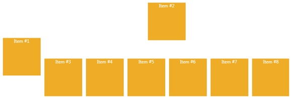

# DockPanel
_Only available in the Plus Edition_

Derives from AnimationPanel

Exactly like WPF's native DockPanel, except that this panel can animate its children and be used inside a SwitchPanel.

## Properties
|| Property || Description
| * | All the Properties from [Canvas](Canvas) Panel
| LastChildFill | Gets or sets is the last child is filled.

## Events
|| Event || Description
| * | All the Events from [Canvas](Canvas) Panel.

## Methods
|| Method || Description
| GetDock( DependencyObject d ) | Gets the Dock property
| SetDock( DependencyObject d, Dock value ) | Sets the Dock property
---