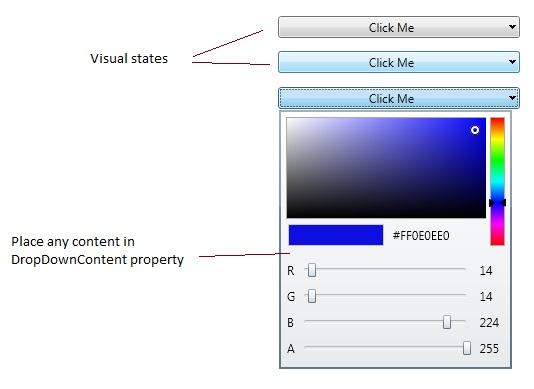

# DropDownButton
Derives from ContentControl

The DropDownButton control is a button that when clicked displays a drop down in which you can place any custom content. 

{{
        <extToolkit:DropDownButton Content="Click Me" Margin="15" >
            <extToolkit:DropDownButton.DropDownContent>
                <extToolkit:ColorCanvas />
            </extToolkit:DropDownButton.DropDownContent>
        </extToolkit:DropDownButton>
}}

## Properties
|| Property || Description
| Button | Gets or sets the button used by the control.
| Command | Gets or sets the command to execute when the button is clicked.
| CommandParameter | Gets or sets the command parameter to pass to the **Command** when the button is clicked.
| CommandTarget | Gets or sets the element on which to raise the specified command.
| Content | Gets or sets the object to use as the button's content.
| DropDownContent | Gets or sets the object to use as the drop down button's content.
| IsOpen | Gets or sets a value indicating whether or not the drop down is open.
| MaxDropDownHeight | Gets or sets the Maximum height of the popup in the control. Default is SystemParameters.PrimaryScreenHeight / 2.

## Events
|| Event || Description
| Click | Raised when the button is clicked.
| Closed | Raised when the DropDownButton dropdown closes.
| Opened | Raised when the DropDownButton dropdown opens.

**Support this project, check out the [Plus Edition](https://xceed.com/xceed-toolkit-plus-for-wpf/).**
---