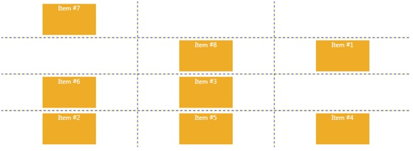

# Grid
_Only available in the Plus Edition_

Derives from AnimationPanel

Exactly like WPF's native Grid panel, except that this panel can animate its children and be used inside a SwitchPanel.

## Properties
|| Property || Description
| * | All the Properties from [Canvas](Canvas) Panel
| ColumnDefinitions | Gets the ColumnDefinition collection.
| RowDefinitions | Gets the RowDefinition collection.
| ShowGridLines | Gets or sets if the GridLines are shown.

## Events
|| Event || Description
| * | All the Events from [Canvas](Canvas) Panel.

## Methods
|| Method || Description
| GetColumn( DependencyObject d ) | Gets the Column property.
| SetColumn( DependencyObject d, int value ) | Sets the Column property.
| GetColumnSpan( DependencyObject d ) | Gets the columnSpan property.
| SetColumnSpan( DependencyObject d, int value ) | Sets the columnSpan property.
| GetRow( DependencyObject d ) | Gets the row Property.
| SetRow( DependencyObject d, int value ) | Sets the row property.
| GetRowSpan( DependencyObject d ) | Gets the rowSpan property.
| SetRowSpan( DependencyObject d, int value ) | Sets the rowSpan property.
---