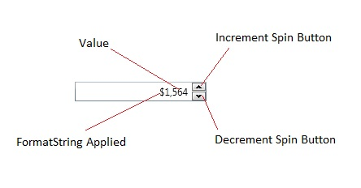
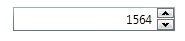
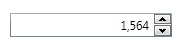

# IntegerUpDown
The IntegerUpDown control provides a TextBox with button spinners that allow incrementing and decrementing Nullable<int> values by using the spinner buttons, keyboard up/down arrows, or mouse wheel.

* [Usage](#usage)
* [Applying Format Strings](#formatstring)
* [Supported Format Strings](#supportedformatstring)
* [Watermark](#watermarks)
* [Properties](#properties)
* [Events](#events)
{anchor:usage}
## Usage

When using the IntegerUpDown in data binding scenarios, bind your object's value to the **Value** property.  You can specify how much to increment the value by setting the **Increment** property.   You can control the minimum and maximum allowed values by setting the **Minimum** and the **Maximum** properties. Use IsReadOnly to determine whether the control is read only. If you would like to get the actual formatted string representation of the value, you can use the **Text** property.

{anchor:formatstring}
## Applying FormatStrings

**Default:**

{{
     <xctk:IntegerUpDown Value="1564" />}}

**Number:**

{{
     <xctk:IntegerUpDown FormatString="N0" Value="1564" Increment="1" Maximum="200000"/>
}}

**Currency:**

{{
     <xctk:IntegerUpDown FormatString="C0" Value="1564" Increment="1" Maximum="5000" Minimum="50"/>
}}

{anchor:supportedformatstring}
## Supported Format Strings

|| Format Specifier || Name
| C | Currency
| F | Fixed Point  
| G | General
| N | Number
| P | Percent  

{anchor:watermarks}
## Watermark
You can provide a **Watermark** to show text in place of a NULL **Value**.

{{
     <xctk:IntegerUpDown Watermark="Enter Integer" />
}}
{anchor:properties}
## Properties
|| Property || Description
| AllowSpin | Gets or sets the ability to perform increment/decrement operations via the keyboard, button spinners, or mouse wheel. (Inherited from UpDownBase)
| AllowTextInput | Determines if the editable part of the control can be edited. The editable part does not include buttons or spinners, it is typically the text part.
| AutoMoveFocus | Gets or sets if the focus can move from this control to other controls. (Inherited from NumericUpDown)
| AutoSelectBehavior | Gets or sets a value indicating how the content of the auto-select text box is selected (Never or OnFocus). By default, OnFocus. (Inherited from NumericUpDown)
| ButtonSpinnerLocation | Gets/Sets the location of the Up/Down buttons (either on the left or on the right) of numericUpDown controls.
| ClipValueToMinMax | Gets or sets if the value should be clipped when minimum/maximum is reached. (Inherited from UpDownBase)
| CultureInfo | Gets or sets the current CultureInfo. (Inherited from InputBase)
| DefaultValue | Gets or sets the value to use when the **Value** is null and an increment/decrement operation is performed. (Inherited from UpDownBase)
| DisplayDefaultValueOnEmptyText | Gets or sets if the defaultValue should be displayed when the Text is empty. (Inherited from UpDownBase)
| FormatString | Gets or sets the dispaly format of the **Value**.
| Increment | Gets or sets the amount in which to increment the value. (Inherited from NumericUpDown)
| IsReadOnly | Gets or sets if the control is read only. (Inherited from InputBase)
| Maximum | Gets or sets the maximum allowed value. (Inherited from UpDownBase)
| Minimum | Gets or sets the minimum allowed value. (Inherited from UpDownBase)
| MouseWheelActiveTrigger | Gets or sets when the MouseWheel is active (Focused, FocusedMouseOver, MouseOver, Disabled). By default, FocusedMouseOver. (Inherited from UpDownBase).
| ParsingNumberStyle | Gets or sets the parsing style (AllowLeadingWhite, Float, AllowHexSpecifier, ...). By default, Any. (Inherited from CommonNumericUpDown)
| ShowButtonSpinner | Gets or sets if the ButtonSpinners are visibles. (Inherited from UpDownBase)
| Text | Gets or sets the formated string representation of the value. (Inherited from InputBase)
| TextAlignment | Gets or sets the alignment of the **Text** (Left, Right, Center, Justify). By default, Left. (Inherited from InputBase)
| UpdateValueOnEnterKey | Gets or sets a value indicating whether the synchronization between "Value" and "Text" should be done only on the Enter key press (and lost focus). (Inherited from UpDownBase)
| Value | Gets or sets the numeric value. (Inherited from UpDownBase)	
| Watermark | Gets or sets the object to use as a watermark if the **Value** is null. (Inherited from InputBase)
| WatermarkTemplate| Gets or sets the DatTemplate to use for the **Watermark**. (Inherited from InputBase)
{anchor:events}
## Events
|| Event || Description
| InputValidationError | Occurs when the Text cannot be converted to a valid Value. (Inherited from UpDownBase)
| ValueChanged | Raised when the Value changes. (Inherited from UpDownBase)

**Support this project, check out the [Plus Edition](http://wpftoolkit.com).**
---