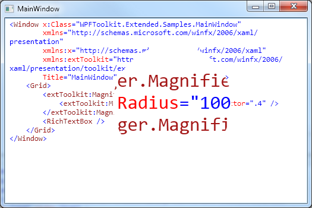
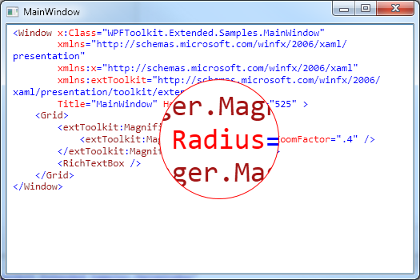

# Magnifier
Derives from Control

The Magnifier control does exactly what is sounds like.  It allows a user to magnify parts of an application.

* [Usage](#usage)
* [Properties](#properties)
* [Example](#example)

{anchor:usage}
## Usage

You can add the Magnifier to any element that is of type UIElement. This is done by using the MagnifierManager. You simply set the MagnifierManager.Magnifier property to the toolkit's Magnifier instance. The following snippet adds the Magnifier to the parent grid of a Window.

{{
<Window x:Class="WPFToolkit.Extended.Samples.MainWindow"
        xmlns="http://schemas.microsoft.com/winfx/2006/xaml/presentation"
        xmlns:x="http://schemas.microsoft.com/winfx/2006/xaml"
        xmlns:extToolkit="http://schemas.microsoft.com/winfx/2006/xaml/presentation/toolkit/extended"
        Title="MainWindow" Height="350" Width="525" >
    <Grid>
        <extToolkit:MagnifierManager.Magnifier>
            <extToolkit:Magnifier Radius="100" ZoomFactor=".4" />
        </extToolkit:MagnifierManager.Magnifier>
        <RichTextBox />
    </Grid>
</Window>
}}
Now everything that is contained within the Grid will have the ability to be magnified.

{anchor:properties}
## Properties

You can control the appearance of the Magnifier by setting some of the available properties.

|| Name || Description
| FrameType | Gets or sets the type of frame used by the Magnifier.
| Radius | Gets or sets the radius/size of the Magnifier
| Target | Gets or sets the UIElement to which the Magnifier is attached.
| ZoomFactor | Gets or sets the amount to zoom into an element.  The value ranges from 0.0 to 1.0.  The smaller the number, the further zoomed in you are.  1.0 is normal text or 100% of orignial size, 0.0 is the most you can zoom in.

{anchor:example}
## Example

The following code snippet attaches a Magnifier to a Window's parent Grid that has a Radius of 75, a red boder that is 1 pixel thick, and a ZoomFactor of 0.3526.

{{
<Window x:Class="WPFToolkit.Extended.Samples.MainWindow"
        xmlns="http://schemas.microsoft.com/winfx/2006/xaml/presentation"
        xmlns:x="http://schemas.microsoft.com/winfx/2006/xaml"
        xmlns:extToolkit="http://schemas.microsoft.com/winfx/2006/xaml/presentation/toolkit/extended"
        Title="MainWindow" Height="350" Width="525" >
    <Grid>
        <extToolkit:MagnifierManager.Magnifier>
            <extToolkit:Magnifier BorderBrush="Red"
                                  BorderThickness="1"
                                  Radius="75" 
                                  ZoomFactor=".3526" />
        </extToolkit:MagnifierManager.Magnifier>
        <RichTextBox />
    </Grid>
</Window>
}}

**Support this project, check out the [Plus Edition](https://xceed.com/xceed-toolkit-plus-for-wpf/).**
---