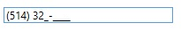

# MaskedTextBox
Derives from Xceed.Wpf.Toolkit.Primitives.ValueRangeTextBox

Represents a control that limits the input text to the format determined by the specified mask.

Note: This version of MaskedTextBox replaces the toolkit's original control, providing a much more complete API. The original control is still available in the Xceed.Wpf.Toolkit.Obselete namespace; see [MaskedTextBox (obsolete version)](MaskedTextBox-(obsolete-version)).

{{
<sample:DemoView x:Class="Samples.Modules.Text.Views.MaskedTextBoxView"
                 xmlns="http://schemas.microsoft.com/winfx/2006/xaml/presentation"
                 xmlns:x="http://schemas.microsoft.com/winfx/2006/xaml"
                 xmlns:sample="clr-namespace:Samples.Infrastructure.Controls;assembly=Samples.Infrastructure"
                 xmlns:xctk="http://schemas.xceed.com/wpf/xaml/toolkit"
                 xmlns:osb="clr-namespace:Xceed.Wpf.Toolkit.Obselete;assembly=WPFToolkit.Extended"
                 xmlns:s="clr-namespace:System;assembly=mscorlib"
                 Title="MaskedTextBox"
                 Description="The MaskedTextBox control lets you display and edit values based on a mask.">
   <Grid>

      <Grid.RowDefinitions>
         <RowDefinition Height="Auto" />
         <RowDefinition Height="*" />
      </Grid.RowDefinitions>

      <GroupBox Header="Features" Grid.Row="0" Margin="5">
         <StackPanel Margin="5">
            <Grid>
               <Grid.RowDefinitions>
                  <RowDefinition Height="Auto" />
                  <RowDefinition Height="Auto" />
               </Grid.RowDefinitions>
               <Grid.ColumnDefinitions>
                  <ColumnDefinition Width="Auto" />
                  <ColumnDefinition Width="*" />
               </Grid.ColumnDefinitions>

               <TextBlock Text="Include literals:" VerticalAlignment="Center" Margin="2" />
               <CheckBox x:Name="_literals" Grid.Column="1" VerticalAlignment="Center" Margin="5" 
                         IsChecked="{Binding IncludeLiteralsInValue, ElementName=_maskedTextBox, 

Mode=TwoWay}"/>

               <TextBlock Text="Include prompt:" Grid.Row="1" VerticalAlignment="Center" Margin="2" />
               <CheckBox x:Name="_prompt" Grid.Row="1" Grid.Column="1" VerticalAlignment="Center" Margin="5" 
                         IsChecked="{Binding IncludePromptInValue, ElementName=_maskedTextBox, Mode=TwoWay}"/>
            </Grid>
            <Grid Margin="0,5,0,0">
               <Grid.RowDefinitions>
                  <RowDefinition Height="Auto" />
                  <RowDefinition Height="Auto" />
                  <RowDefinition Height="Auto" />
               </Grid.RowDefinitions>
               <Grid.ColumnDefinitions>
                  <ColumnDefinition Width="Auto" />
                  <ColumnDefinition Width="*" />
               </Grid.ColumnDefinitions>

               <TextBlock Text="Mask:" VerticalAlignment="Center" Margin="2" />
               <TextBox x:Name="_mask" Grid.Column="1" VerticalAlignment="Center" Margin="5" 
                        Text="{Binding Mask, ElementName=_maskedTextBox, ValidatesOnExceptions=True}" />

               <TextBlock Text="Value:" Grid.Row="1" VerticalAlignment="Center" Margin="2" />
               <TextBox x:Name="_value" Grid.Row="1" Grid.Column="1" VerticalAlignment="Center" Margin="5"
                        Text="{Binding Value, ElementName=_maskedTextBox, ValidatesOnExceptions=True}"  />

               <TextBlock Text="Text:" Grid.Row="2" VerticalAlignment="Center" Margin="2" />
               <TextBox x:Name="_text" Grid.Row="2" Grid.Column="1" VerticalAlignment="Center" Margin="5" 
                        Text="{Binding Text, ElementName=_maskedTextBox, ValidatesOnExceptions=True}"/>
            </Grid>
         </StackPanel>
      </GroupBox>

      <StackPanel Grid.Row="1" Margin="10">
         <xctk:MaskedTextBox x:Name="_maskedTextBox"
                             Mask="(000) 000-0000"
                             ValueDataType="{x:Type s:String}" />

      </StackPanel>
   </Grid>
</sample:DemoView>
}}

## Supported Masks
|| Masking Element || Description
| 0 | Digit, required. This element will accept any single digit between 0 and 9.
| 9 | Digit or space, optional.
| # | Digit or space, optional. If this position is blank in the mask, it will be rendered as a space in the Text property. Plus (+) and minus (-) signs are allowed.
| L | Letter, required. Restricts input to the ASCII letters a-z and A-Z. This mask element is equivalent to [a-zA-Z](a-zA-Z) in regular expressions.
| ? | Letter, optional. Restricts input to the ASCII letters a-z and A-Z. This mask element is equivalent to [a-zA-Z](a-zA-Z)? in regular expressions.
| & | Character, required. If the AsciiOnly property is set to true, this element behaves like the "L" element.
| C | Character, optional. Any non-control character. If the AsciiOnly property is set to true, this element behaves like the "?" element.
| A | Alphanumeric, optional. If the AsciiOnly property is set to true, the only characters it will accept are the ASCII letters a-z and A-Z.
| a | Alphanumeric, optional. If the AsciiOnly property is set to true, the only characters it will accept are the ASCII letters a-z and A-Z.
| . | Decimal placeholder. The actual display character used will be the decimal symbol appropriate to the format provider, as determined by the control's FormatProvider property.
| , | Thousands placeholder. The actual display character used will be the thousands placeholder appropriate to the format provider, as determined by the control's FormatProvider property.
| : | Time separator. The actual display character used will be the time symbol appropriate to the format provider, as determined by the control's FormatProvider property.
| / | Date separator. The actual display character used will be the date symbol appropriate to the format provider, as determined by the control's FormatProvider property.
| $ | Currency symbol. The actual character displayed will be the currency symbol appropriate to the format provider, as determined by the control's FormatProvider property.
| < | Shift down. Converts all characters that follow to lowercase.
| > | Shift up. Converts all characters that follow to uppercase.
| | Disable a previous shift up or shift down.
| \ | Escape. Escapes a mask character, turning it into a literal. "\\" is the escape sequence for a backslash.

## Properties
|| Property || Description
| AutoMoveFocus | Gets or sets a value indicating if the focus can navigate in the appropriate flow direction (e.g., from one cell to another when a cell is being edited) when the cursor is at the beginning or end of the auto-select text box. (Inherited from Xceed.Wpf.Toolkit.AutoSelectTextBox)
| AutoSelectBehavior | Gets or sets a value indicating how the content of the auto-select text box is selected (Never or OnFocus). By default Never.
| BeepOnError | Gets or sets whether a beep sound will be played on error. (Inherited from Xceed.Wpf.Toolkit.Primitives.ValueRangeTextBox)
| FormatProvider | Gets or sets the format provider. (Inherited from Xceed.Wpf.Toolkit.Primitives.ValueRangeTextBox)
| HasParsingError | Gets whether the control has a parsing error. (Inherited from Xceed.Wpf.Toolkit.Primitives.ValueRangeTextBox)
| HasValidationError | Gets whether the control has a validation error. (Inherited from Xceed.Wpf.Toolkit.Primitives.ValueRangeTextBox)
| InsertKeyMode | Gets or sets a value representing the text insertion mode of the masked text box.  
| IsMaskCompleted | Gets a value indicating if all required characters have been inputted into the mask.  
| IsMaskFull | Gets a value indicating if all characters, required and optional, have been inputted into the mask.
| IsValueOutOfRange | Gets whether the control's value is out of range. (Inherited from Xceed.Wpf.Toolkit.Primitives.ValueRangeTextBox)
| Mask | Gets or sets the input mask.  
| MaskTextProvider | Gets the MaskedTextProvider that was used to mask the input text.  
| MaxValue | Gets or sets the maximum value of the control. (Inherited from Xceed.Wpf.Toolkit.Primitives.ValueRangeTextBox)
| MinValue | Gets or sets the minimum value of the control. (Inherited from Xceed.Wpf.Toolkit.Primitives.ValueRangeTextBox)
| NullValue | Gets or sets the null value. (Inherited from Xceed.Wpf.Toolkit.Primitives.ValueRangeTextBox)
| PromptChar | Gets or sets the character that represents the positions in the masked text box that require user input.  
| RejectInputOnFirstFailure | Gets or sets a value indicating if inputted text that is pasted into the masked text box can be rejected if it contains an invalid character for the corresponding mask position.  
| ResetOnPrompt | Gets or sets a value indicating if the character at the current caret position should be reset when the prompt character is pressed.  
| ResetOnSpace | Gets or sets a value indicating if the character at the current caret position should be reset when the space bar is pressed.  
| RestrictToAscii | Gets or sets a value indicating if the masked text box accepts non-ASCII characters.  
| SkipLiterals | Gets or sets a value indicating if literal values can be overwritten by their same values.  
| Text | Content of the MaskedTextBox. (Inherited from System.Windows.Controls.TextBox)
| Value | Gets or sets the value of the MaskedTextBox. (Inherited from Xceed.Wpf.Toolkit.Primitives.ValueRangeTextBox)
| ValueDataType | Gets or sets the Type of the value. (Inherited from Xceed.Wpf.Toolkit.Primitives.ValueRangeTextBox)

## Events
|| Event || Description
| QueryTextFromValue | Raised when an attempt is made to convert the specified value into its string representation. (Inherited from Xceed.Wpf.Toolkit.Primitives.ValueRangeTextBox)
| QueryValueFromText | Raised when an attempt is made to extract a value from the specified text. (Inherited from Xceed.Wpf.Toolkit.Primitives.ValueRangeTextBox)

**Support this project, check out the [Plus Edition](https://xceed.com/xceed-toolkit-plus-for-wpf/).**
---