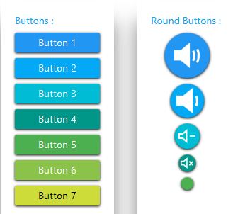

# MaterialButton
_Only available in the Plus Edition_

Derives from Button

The MaterialButton control represents a button control that uses the material colors and animations.

## Properties
|| Property || Description
| InkEffectBrush | Gets or sets the brush to use for the ink effect when the button is pressed.
| InkEffectOpacity | Gets or sets the opacity to use for the InkEffectBrush when the button is pressed.
| IsInkEffectActive | Gets or sets a value indicating whether the ink effect will be shown when the button is pressed.
| IsRaisedActive | Gets or sets a value indicating whether the raised effect will be used when the mouse is over the button.
| MaterialAccent | Gets or sets a value representing the material color palette that will be applied to the control.
| MaterialAccentBrush | Gets or sets the color that will be used as the control's background.
| MaterialForeground | Gets or sets the color to use as the control's foreground.
| Mode | Gets or sets a value representing the button's shape.
---