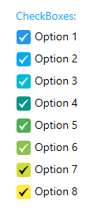

# MaterialCheckBox
_Only available in the Plus Edition_

Derives from CheckBox

The MaterialCheckBox control represents a checkbox control that uses the material colors and animations.

## Properties
|| Property || Description
| CheckMarkBrush | Gets or sets the brush to use for the checkmark.
| CornerRadius | Gets or sets the corner radius of the checkbox.
| MaterialAccent | Gets or sets a value representing the material color palette that will be applied to the control.
| MaterialAccentBrush | Gets or sets the color that will be used as the control's background and border.
| MaterialForeground | Gets or sets the color to use as the control's foreground.
---