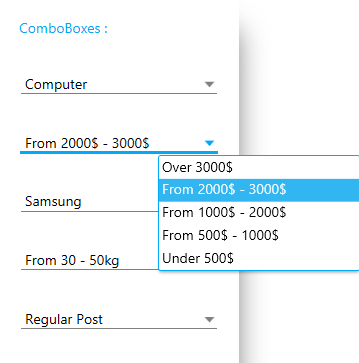

# MaterialComboBox
_Only available in the Plus Edition_

Derives from ComboBox

The MaterialComboBox control represents a ComboBox control that uses the material colors and animations.

## Properties
|| Property || Description
| InkEffectBrush | Gets or sets the brush to use for the ink effect when the combo-box item is selected.
| InkEffectOpacity | Gets or sets the opacity to use for the ink effect brush on when a combo-box item is selected.
| IsInkEffectActive | Gets or sets a value indicating whether the ink effect will be shown on a combo-box item when it is selected.
| IsUsingFadeAnimation | Gets or sets a value indicating whether the fading animation will be used when opening the dropdown.
| LineBrush | Gets ot sets the brush to use for the line under the text when the control is not focused.
| LineFocusBrush | Gets ot sets the brush to use for the line under the text when the control is focused.
| MaterialAccent | Gets or sets a value representing the material color palette that will be applied to the control.
| MaterialAccentBrush | Gets or sets the color that will be used as the control's background and border.
| MaterialForeground | Gets or set the color to use for the control's foreground and ink-effect.
---