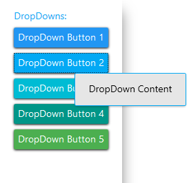

# MaterialDropDown
_Only available in the Plus Edition_

Derives from DropDownButton

The MaterialDropDown represents a drop-down button control that uses the material colors and animations.

## Properties
|| Property || Description
| Command | Gets or sets the command to execute when the button is clicked. (Inherited from Xceed.Wpf.Toolkit.DropDownButton)
| CommandParameter | Gets or sets the command parameter to pass to the Command when the button is clicked (Inherited from Xceed.Wpf.Toolkit.DropDownButton)
| CommandTarget | Gets or sets the element on which to raise the specified command. (Inherited from Xceed.Wpf.Toolkit.DropDownButton)
| DropDownContent | Get or sets the object to use as the drop down button's content. (Inherited from Xceed.Wpf.Toolkit.DropDownButton)
| DropDownPosition | Gets or sets the position of the dropdown. (Inherited from Xceed.Wpf.Toolkit.DropDownButton)
| InkEffectBrush | Gets or sets the brush to use for the ink effect when the drop-down's button is pressed.
| InkEffectOpacity | Gets or sets the opacity to use for the InkEffectBrush when the drop-down's button is pressed.
| IsInkEffectActive | Gets or sets a value indicating whether the ink effect will be shown when the drop-down's button is pressed.
| IsOpen | Gets or sets a value indicating whether the dropdown is open. (Inherited from Xceed.Wpf.Toolkit.DropDownButton)
| IsUsingFadeAnimation | Gets or sets a value indicating whether the fading animation will be used when opening the dropdown.
| MaterialAccent | Gets or sets a value representing the material color palette that will be applied to the control.
| MaterialAccentBrush | Gets or sets the color that will be used as the control's background.
| MaterialForeground | Gets or sets the color to use as the control's foreground.
| MaxDropDownHeight | Gets or sets a value representing the maximum height of the popup in the control. (Inherited from Xceed.Wpf.Toolkit.DropDownButton)

## Events
|| Event || Description
| Click | Raised when the control is clicked (Inherited from Xceed.Wpf.Toolkit.DropDownButton)
| Closed | Raised when the DropDownButton dropdown has closed. (Inherited from Xceed.Wpf.Toolkit.DropDownButton)
| Opened | Raised when the DropDownButton dropdown has opened. (Inherited from Xceed.Wpf.Toolkit.DropDownButton)
---