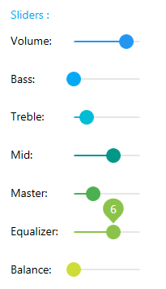

# MaterialSlider
_Only available in the Plus Edition_

Derives from Slider

The MaterialSlider represents a slider control that uses the material colors and animations.

## Properties
|| Property || Description
| BubbleLocation | Gets or sets the location of the bubble.
| BubbleTemplate | Gets or sets the bubble's DataTemplate.
| MaterialAccent | Gets or sets a value representing the material color palette that will be applied to the control.
| MaterialAccentBrush | Gets or sets the color that will be used as the control's background and border.
| MaterialForeground | Gets or sets the color to use as the control's foreground.
| Mode | Gets or sets the slider's mode.
| NearestTick | Gets the tick that is the closest from the current value.
| ShowTicks | Gets or sets a value indicating whether the ticks are shown.
| ThumbResizeScaleFactor | Gets or sets the scale factor to use for the thumb when its Mode property is set to **ThumbResize**.
| ThumbStyle | Gets or sets the thumb's style.
---