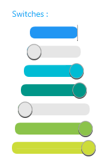

# MaterialSwitch
_Only available in the Plus Edition_

Derives from [ToggleSwitch](ToggleSwitch)

The MaterialSwitch represents a ToogleSwitch control that uses the material colors and animations.

## Properties
|| Property || Description
| CheckedBackground | Gets or sets the Brush for the background on the checked side. (Inherited from Xceed.Wpf.Toolkit.ToggleSwitch)
| CheckedContent | Gets or set the content that is displayed when the toggle switch is checked. (Inherited from Xceed.Wpf.Toolkit.ToggleSwitch)
| CheckedForeground | Gets or sets the Brush for the CheckedLabel’s Foreground. (Inherited from Xceed.Wpf.Toolkit.ToggleSwitch)
| CheckedToolTip | Gets or sets the ToolTip to use when the mouse is over the checked side. (Inherited from Xceed.Wpf.Toolkit.ToggleSwitch)
| CornerRadius | Gets or sets the CornerRadius to use for the ToggleSwitch and its thumb button. (Inherited from Xceed.Wpf.Toolkit.ToggleSwitch)
| InnerMargin | Gets or sets the margin to apply on the inner content of the ToggleSwitch. (Inherited from Xceed.Wpf.Toolkit.ToggleSwitch)
| IsChecked | Gets or sets if the ToggleSwitch is currently in the checked state. (Inherited from Xceed.Wpf.Toolkit.ToggleSwitch)
| IsCheckedLeft | Gets or sets if the checked value is on the left side of the ToggleSwitch. (Inherited from Xceed.Wpf.Toolkit.ToggleSwitch)
| MaterialAccent | Gets or sets a value representing the material color palette that will be applied to the control.
| MaterialAccentBrush | Gets or sets the color that will be used as the control's thumb checked background.
| MaterialForeground | Gets or sets the color to use as the control's and its thumb foreground.
| OuterMargin | Gets or sets the margin to apply on the outer border part of the ToggleSwitch. (Inherited from Xceed.Wpf.Toolkit.ToggleSwitch)
| ThumbBackground | Gets or sets the Brush for the Thumb’s Background. (Inherited from Xceed.Wpf.Toolkit.ToggleSwitch)
| ThumbBorderBrush | Gets or sets the Brush for the Thumb’s Border. (Inherited from Xceed.Wpf.Toolkit.ToggleSwitch)
| ThumbBorderThickness | Gets or sets the Thickness for the Thumb’s Border. (Inherited from Xceed.Wpf.Toolkit.ToggleSwitch)
| ThumbCheckedBackground | Gets or sets the background of the thumb when control is checked.
| ThumbElasticity | Gets or sets how far the Thumb must be dragged before it switches to the other value (as a percentage of the ToggleSwitch width). (Inherited from Xceed.Wpf.Toolkit.ToggleSwitch)
| ThumbForeground | Gets or sets the Brush for the Thumb’s Foreground. (Inherited from Xceed.Wpf.Toolkit.ToggleSwitch)
| ThumbHeight | Gets or sets the height of the thumb. (Inherited from Xceed.Wpf.Toolkit.ToggleSwitch)
| ThumbHoverBackground | Gets or sets the Brush for the Thumb’s Background (hover state). (Inherited from Xceed.Wpf.Toolkit.ToggleSwitch)
| ThumbHoverBorderBrush | Gets or sets the Brush for the Thumb’s Border (hover state). (Inherited from Xceed.Wpf.Toolkit.ToggleSwitch)
| ThumbLeftContent | Gets or sets the content that is displayed on the Thumb button when it is located on the left side of the ToggleSwitch. (Inherited from Xceed.Wpf.Toolkit.ToggleSwitch)
| ThumbPressedBackground | Gets or sets the Brush for the Thumb’s Background (pressed state). (Inherited from Xceed.Wpf.Toolkit.ToggleSwitch)
| ThumbPressedBorderBrush | Gets or sets the Brush for the Thumb’s Border (pressed state). (Inherited from Xceed.Wpf.Toolkit.ToggleSwitch)
| ThumbRightContent | Gets or sets the content that is displayed on the Thumb button when it is located on the right side of the ToggleSwitch. (Inherited from Xceed.Wpf.Toolkit.ToggleSwitch)
| ThumbStyle | Gets or sets the style to use for the thumb in the ToggleSwitch control. (Inherited from Xceed.Wpf.Toolkit.ToggleSwitch)
| ThumbWidth | Gets or sets the width of the thumb. (Inherited from Xceed.Wpf.Toolkit.ToggleSwitch)
| UncheckedBackground | Gets or sets the Brush for the Background of the unchecked side. (Inherited from Xceed.Wpf.Toolkit.ToggleSwitch)
| UncheckedContent | Gets or set the content that is displayed when the toggle switch is un-checked. (Inherited from Xceed.Wpf.Toolkit.ToggleSwitch)
| UncheckedForeground | Gets or sets the Brush for the UncheckedLabel’s Foreground. (Inherited from Xceed.Wpf.Toolkit.ToggleSwitch)
| UncheckedToolTip | Gets or sets the ToolTip to use when the mouse is over the unchecked side. (Inherited from Xceed.Wpf.Toolkit.ToggleSwitch)

## Events
|| Event || Description
| IsCheckedLeftValueChanged | Event called when the ToggleSwitch’s IsChecked value has been changed. (Inherited from Xceed.Wpf.Toolkit.ToggleSwitch)
| IsCheckedValueChanged | Event called when the ToggleSwitch’s IsCheckedLeft value has been changed. (Inherited from Xceed.Wpf.Toolkit.ToggleSwitch)
---