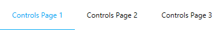

# MaterialTabControl
_Only available in the Plus Edition_

Derives from TabControl

The MaterialTabControl represents a TabControl that uses the material colors and animations.

## Properties
|| Property || Description
| InkBarBrush | Gets or sets the brush to use for the ink bar located under the selected tab item.
| InkEffectBrush | Gets or sets the brush to use for the ink effect when pressing a tab item.
| InkEffectOpacity | Gets or sets the opacity to use for the ink effect brush on when a tab item is selected.
| IsInkBarActive | Gets or sets a value indicating whether the ink bar will be shown under the selected tab item.
| IsInkEffectActive | Gets or sets a value indicating whether the ink effect will be shown on a tab item when it is pressed.
| IsSlidingAnimationActive | Gets ot sets a value indicating whether the sliding transition animation will be used when changing the selected tab item.
| MaterialAccent | Gets or sets a value representing the material color palette that will be applied to the control.
| MaterialAccentBrush | Gets or sets the color that will be used as the control's ink-effect and ink-bar brushes.
| NextItem | Gets the next tab item to slide in.
| PreviousItem | Gets the previous tab item to slide out.
| SelectedForeground | Gets or sets the foreground to use for the selected tab item.
---