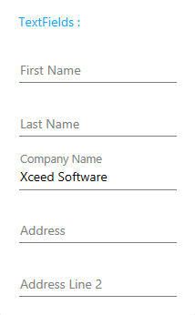

# MaterialTextField
_Only available in the Plus Edition_

Derives from TextBox

The MaterialTextField represents a text field that contains a customizable watermark that remains active when text is entered and uses the material colors and animations.

## Properties
|| Property || Description
| LineBrush | Gets ot sets the brush to use for the line under the text when the control is not focused.
| LineFocusBrush | Gets ot sets the brush to use for the line under the text when the control is focused.
| MaterialAccent | Gets or sets a value representing the material color palette that will be applied to the control.
| MaterialAccentBrush | Gets or sets the color that will be used as the control's watermark-focus and line-focus brushes.
| Watermark | Gets or sets the control's watermark.
| WatermarkFocusBrush | Gets or sets the brush to use for the watermark when the control is focused.
| WatermarkForeground | Gets or sets the watermark foreground when the control is not focused.
| WatermarkMode | Gets or sets a value indicating how the watermark will behave when the control receives the focus.
| WatermarkScaleFactor | Gets or sets the scale factor to use for the watermark when the control is focused and watermark is moved up.
| WatermarkTemplate | Gets or sets the DataTemplate to use for the watermark.
---