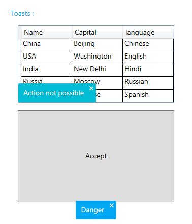

# MaterialToast
_Only available in the Plus Edition_

Derives from ContentControl

The MaterialToast represents a ContentControl that can be used to display content in any corner or any window or FrameworkElement. It uses the material colors and animations.

## Properties
|| Property || Description
| CloseButtonStyle | Gets or sets the style to use for the close button.
| CornerRadius | Gets or sets the control's corner radius.
| DisplayTime | Gets or sets the number of milliseconds the control will remain visible.
| HideOnClick | Gets or sets a value indicating whether the control can be closed with a mouse click.
| IsCloseButtonVisible | Gets or sets a value indicating whether the close button will be shown in the control.
| IsOpen | Gets or sets a value indicating whether the controls is shown.
| Location | Gets or sets the location of the control relative to its owner.
| MaterialAccent | Gets or sets a value representing the material color palette that will be applied to the control.
| MaterialAccentBrush | Gets or sets the color that will be used as the control's background.
| MaterialForeground | Gets or sets the color to use as the control's foreground.
| Owner | Gets or sets the owner of the control, which is the element from which it will popup.

## Methods
|| Method || Description
| HideToast | Hides the control.
| ShowToast | Displays the control.

## Events
|| Event || Description
| HideCompleted | Raised when the control has been hidden.
| ShowCompleted | Raised when the control is shown.
---