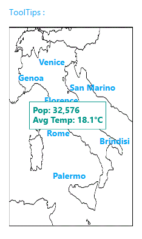

# MaterialToolTip
_Only available in the Plus Edition_

Derives from ToolTip

The MaterialToolTip represents a ToolTip control that uses the material colors and animations.

## Properties
|| Property || Description
| MaterialAccent | Gets or sets a value representing the material color palette that will be applied to the control.
| MaterialAccentBrush | Gets or sets the color that will be used as the control's background.
| MaterialForeground | Gets or sets the color to use as the control's foreground.
---