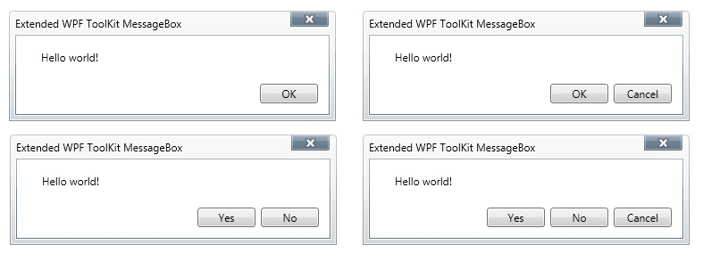
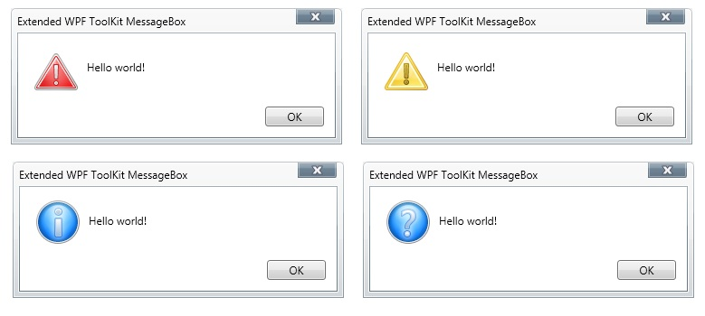
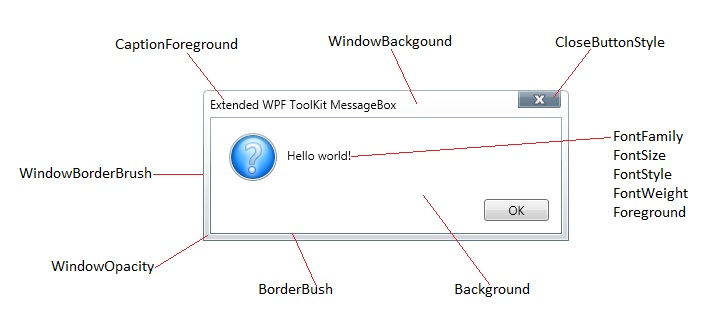
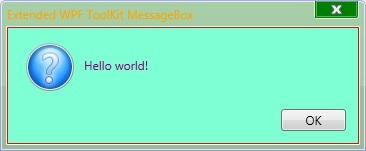

# MessageBox
Derives from Xceed.Wpf.Toolkit.Primitives.WindowControl

Starting with version 2.0, MessageBox (and ChildWindow) is derived from WindowControl and no longer manages its parent’s background or the positioning of itself based on its parent’s size.

A WindowContainer should now be used to contain these controls. It provides an area where WindowControl-derived controls (ChildWindow or MessageBox controls) can be displayed. This is particularly interesting in an XBAP application where windows can't be popped up. In this case the WindowContainer can be sized to fit the application and the window-like control can be moved around in the WindowContainer.

The WindowContainer derives from Canvas and positions its children according to its size. Many actions performed on its children are managed by the WindowContainer (movement and positioning, resizing, visibility, modal, and mouse click). This will restrict the WindowControl movements and resizing to the WindowContainer’s size.

When no Width and Height are specified in the WindowContainer, its DesiredSize will be the size of its biggest child.

* [Buttons](#buttons)
* [Icons](#icons)
* [Usage](#usage)
* [Style Guide](#style)

{anchor:buttons}
**Buttons**

{anchor:icons}
**Icons**

{anchor:usage}
## Usage
The MessageBox mimics the behavior of the System.Windows.MessageBox closely. You use similar syntax to create and show a message box.

{{
      MessageBoxResult result =  Xceed.Wpf.Toolkit.MessageBox.Show("Hello world!", "Extended WPF ToolKit MessageBox", MessageBoxButton.OK, MessageBoxImage.Question);
      MessageBoxResult result =  Xceed.Wpf.Toolkit.MessageBox.Show("Hello world!", "Extended WPF ToolKit MessageBox", MessageBoxButton.OK);
      MessageBoxResult result =  Xceed.Wpf.Toolkit.MessageBox.Show("Hello world!", "Extended WPF ToolKit MessageBox");
      MessageBoxResult result =  Xceed.Wpf.Toolkit.MessageBox.Show("Hello world!");
}}

{anchor:style}
## Style Guide
You can style the MessageBox to fit the theme of your application by using a few of the MessageBox's properties.  The following image depicts what properties modify which parts of the MessageBox control.

## Properties
|| Property || Description
| ButtonRegionBackground | Gets or sets the background of the region behind the message box buttons.  
| CancelButtonContent | Gets or sets the content of the Cancel button.  
| CancelButtonStyle | Gets or sets the style of the Cancel button.  
| Caption | Gets or sets the caption of the message box. (Inherited from Xceed.Wpf.Toolkit.Primitives.WindowControl)
| CaptionForeground | Gets or sets the font color of the caption. (Inherited from Xceed.Wpf.Toolkit.Primitives.WindowControl)
| CaptionIcon | Gets or sets the caption icon. (Inherited from Xceed.Wpf.Toolkit.Primitives.WindowControl)
| CaptionShadowBrush | Gets or sets the brush of the caption's shadow. (Inherited from Xceed.Wpf.Toolkit.Primitives.WindowControl)
| CloseButtonStyle | Gets or sets the style of the close button. (Inherited from Xceed.Wpf.Toolkit.Primitives.WindowControl)
| CloseButtonVisibility | Gets or sets the visibility of the Close button. (Inherited from Xceed.Wpf.Toolkit.Primitives.WindowControl)
| ImageSource | Gets or sets the ImageSource.  
| IsActive | Gets or sets whether the control is active. (Inherited from Xceed.Wpf.Toolkit.Primitives.WindowControl)
| Left | Gets or sets the left side of the control. (Inherited from Xceed.Wpf.Toolkit.Primitives.WindowControl)
| MessageBoxResult | Gets the MessageBox result, which is set when the Closed event is raised.  
| NoButtonContent | Gets or sets the content of the No button.  
| NoButtonStyle | Gets or sets the style of the No button.  
| OkButtonContent | Gets or sets the content of the OK button.  
| OkButtonStyle | Gets or sets the OK button's style.  
| Text | Gets or sets the text of the message box.  
| Top | Gets or sets the top side of the control. (Inherited from Xceed.Wpf.Toolkit.Primitives.WindowControl)
| WindowBackground | Gets or sets the background color of the MessageBox window. (Inherited from Xceed.Wpf.Toolkit.Primitives.WindowControl)
| WindowBorderBrush | Gets or sets the color of the outer border of the MessageBox. (Inherited from Xceed.Wpf.Toolkit.Primitives.WindowControl)
| WindowBorderThickness | Gets or sets the window's border thickness. (Inherited from Xceed.Wpf.Toolkit.Primitives.WindowControl)
| WindowInactiveBackground | Gets or sets the window's inactive background. (Inherited from Xceed.Wpf.Toolkit.Primitives.WindowControl)
| WindowOpacity | Gets or sets the opacity of the MessageBox, but does not effect the close button or the message text area. (Inherited from Xceed.Wpf.Toolkit.Primitives.WindowControl)
| WindowStyle | Gets or sets the window's style. (Inherited from Xceed.Wpf.Toolkit.Primitives.WindowControl)
| WindowThickness | Gets or sets the window's thickness. (Inherited from Xceed.Wpf.Toolkit.Primitives.WindowControl)
| YesButtonContent | Gets or sets the content of the Yes button.  
| YesButtonStyle | Gets or sets the Yes button's style.  

## Events
|| Event || Description
| CloseButtonClicked | Raised when the Close button is clicked. (Inherited from Xceed.Wpf.Toolkit.Primitives.WindowControl)
| Closed | Raised when the message box is closed.  
| HeaderDragDelta | Raised as the mouse changes position when a header has logical focus and mouse capture. (Inherited from Xceed.Wpf.Toolkit.Primitives.WindowControl)
| HeaderIconClicked | Raised when the header icon is clicked. (Inherited from Xceed.Wpf.Toolkit.Primitives.WindowControl)
| HeaderIconDoubleClicked | Raised when the header icon is double-clicked. (Inherited from Xceed.Wpf.Toolkit.Primitives.WindowControl)
| HeaderMouseLeftButtonClicked | Raised when the header is clicked using the left mouse button. (Inherited from Xceed.Wpf.Toolkit.Primitives.WindowControl)
| HeaderMouseLeftButtonDoubleClicked | Raised when the header is double-clicked using the left mouse button. (Inherited from Xceed.Wpf.Toolkit.Primitives.WindowControl)
| HeaderMouseRightButtonClicked | Raised when the header is clicked using the right mouse button. (Inherited from Xceed.Wpf.Toolkit.Primitives.WindowControl)

## Methods
|| Method || Description
| Show | Overloaded. Displays a message box.
| ShowDialog | Display the MessageBox window and returns only when this MessageBox closes.
| ShowMessageBox | Overloaded. Displays this message box when embedded in a WindowContainer parent.

## Example
You can style all instances of your MessageBox control by placing the style definition markup inside your App.xaml file under the resources section. To create the following ugly style requires the following markup.

{{

        <SolidColorBrush x:Key="MyButtonHoverBrush" Color="YellowGreen" />
        <SolidColorBrush x:Key="MyButtonPressedBrush" Color="Maroon" />
        
        
        
        

}}

**Support this project, check out the [Plus Edition](https://xceed.com/xceed-toolkit-plus-for-wpf/).**
---