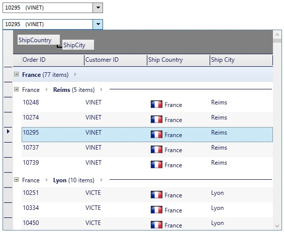

# MultiColumnComboBox
_Only available in the Plus Edition_

Derives from ComboBox

ComboBox control that displays data in columns by using a [DataGrid](DataGrid).

## Properties
|| Property || Description
| AutoCreateColumns | Gets or sets a value indicating whether columns should automatically be created when the control is bound to an ItemsSource.
| Columns | Gets a list of columns to display in the control.
| DataGridStyle | Gets or sets the style to apply to the DataGridControl that will be displayed in the dropdown list.
| ShowColumnHeaders | Gets or sets whether the column headers (ColumnManagerRow) will be displayed at the top of the datagrid control.
| ShowGroupByControl | Gets or sets whether the GroupByControl will be displayed at the top of the datagrid.
---