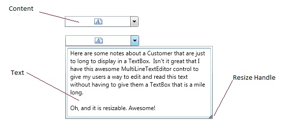

# MultiLineTextEditor
Derives from ContentControl

Represents a resizable multi-line text editor that displays in a dropdown.

## Properties
|| Property || Description
| DropDownHeight | Gets or sets the height of the dropdown.
| DropDownWidth | Gets or sets the width of the dropdown.
| IsOpen | Gets or sets a value indicating whether the dropdown is open.
| IsSpellCheckEnabled | Gets or sets a value indicating whether the spell checker is enabled.
| Text | Gets or sets the text of the MultiLineEditor.
| TextAlignment | Gets or sets the alignment of Text.
| TextWrapping | Gets or sets the text wrapping method of Text.

**Support this project, check out the [Plus Edition](https://xceed.com/xceed-toolkit-plus-for-wpf/).**
---