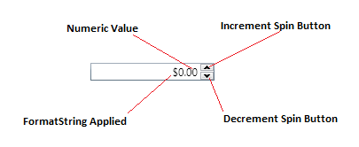
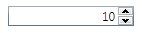
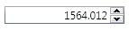
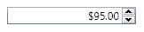

# NumericUpDown
## {"[OBSOLETE](OBSOLETE)"} - Please use one of the new [DecimalUpDown](DecimalUpDown), [DoubleUpDown](DoubleUpDown), or [IntegerUpDown](IntegerUpDown) controls, which all derive from NumericUpDown<T>.
The NumericUpDown control provides a TextBox with button spinners that allow incrementing and decrementing numeric values by using the spinner buttons, keyboard up/down arrows, or mouse wheel.

* [Usage](#usage)
* [Applying Format Strings](#formatstring)
* [Supported Format Strings](#supportedformatstring)
* [Changing Value Types](#changingvaluetypes)

{anchor:usage}
## Usage

When using the NumericUpDown in data binding scenarios, bind your object's value to the NumericUpDown.Value property.  You can specify how much to increment the value by setting the NumericUpDown.Increment property.   You can control the minimum and maximum allowed values by setting the NumericUpDown.Minimum property and the NumericUpDown.Maximum property.  You can also specify if the user can directly edit the values in the text box by setting the IsEditable property.  If you would like to get the actual fromatted string representation of the value, you can use the NumericUpDown.Text property.

{anchor:formatstring}
## Applying FormatStrings

**Default:**

{{
     <xctk:NumericUpDown Value="10" Increment="1" Maximum="10" Minimum="0" />
}}

**Floating Point:**

{{
     <xctk:NumericUpDown Value="1564" Increment=".001" FormatString="F3" Maximum="200000" />
}}

**Currency:**

{{
     <xctk:NumericUpDown Value="95" FormatString="C2" Increment=".5" Maximum="100" Minimum="50" />
}}

{anchor:supportedformatstring}
## Supported Format Strings

|| Format Specifier || Name
| C | Currency
| F | Fixed Point  
| G | General
| N | Number
| P | Percent  

{anchor:changingvaluetypes}
## Changing Value Types
The default data type for the NumericUpDown control is Double, meaning the control is expecting you to data bind to a property of type Double.  If your property's data type is not a Double you must tell the NumericUpDown control to use a different data type for the value.  To support different data types you must set the NumericUpDown.ValueType property to your required data type.

First add a new namespace to the top of your XAML file to mscorlib.  This contains the different data types.

{{
     xmlns:sys="clr-namespace:System;assembly=mscorlib"...
}}

Next, specify the NumericUpDown.ValueType to the required data type. In this example the underlying value is an Int32.

{{
     <xctk:NumericUpDown Value="10" Increment="1" Maximum="10" Minimum="0" ValueType="{x:Type sys:Int32}" />
}}

## Properties / Events

|| Property || Description
| Increment   | Specifies the amount in which to increment the value. 
| IsReadOnly | Gets/Sets a value indicating whether the control is read only. 
| Maximum   | Gets/Sets the maximum allowed value.
| Mimum | Gets/Sets the minimum allowed value.
| SelectAllOnGotFocus | If set to true, all text is selected when control gets focus.
| Text | Gets/Sets the formated string representation of the value. 
| Value | Gets/Sets the numeric value.
| ValueType |  Gets/Sets the value's data type that is being data bound to the control.

|| Event || Description
| ValueChanged | Occurs when the Value changes.