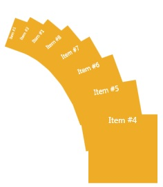

# PerspectivePanel
_Only available in the Plus Edition_

Derives from AnimationPanel

Perspective panel positions its children in a perspective view with the possibility of rotating the background children.

## Properties
|| Property || Description
| * | All the Properties from [Canvas](Canvas) Panel
| ActiveChildIndex | Gets or sets the ActiveChildIndex property. This dependency property indicates the top children.
| AnchorX | Gets or sets the X anchor of the PerspectivePanel.
| AnchorY | Gets or sets the Y anchor of the PerspectivePanel.
| AngleOfTwist | Gets or sets the Decay for the distance to which adjacent children lay out.
| DecayConstant | Gets or sets the DecayConstant property.
| ScaleFactorX | Gets or sets the ScaleFactorX property.
| ScaleFactorY | Gets or sets the ScaleFactorY property.
| ShiftX | Gets or sets the ShiftX property.
| ShiftY | Gets or sets the ShiftY property.

## Events
|| Event || Description
| * | All the Events from [Canvas](Canvas) Panel.
---