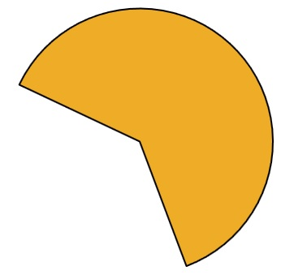

# PieChart
Derives from Xceed.Wpf.Toolkit.Primitives.ShapeBase

Draws an arcing segment of a circle, letting developers display data in an easily digestible format, such as in pie charts, or even in things such as pie clocks and pie progress indicators.

The Pie shape is a WPF shape that represents a portion of an ellipse. It is in the same shape as a slice of pie (hence the name). More precisely, the Pie shape is represented as either a full ellipse (Slice = 1.0), nothing (Slice = 0.0), or an arc of an ellipse joined to its center by two line segments.

## Properties
|| Property || Description
| DefiningGeometry Overridden | Gets the geometry object defining the pie shape.
| EndAngle | Gets or sets the end angle (in degrees, with 0 on the right) of the pie.
| GeometryTransform (Overridden) | Gets the identity transform, since pie objects do not use geometry transforms.
| Mode | Gets or sets the PieMode(Manual, EndAngle, Slice). By default, Manual.
| RenderedGeometry (Overridden) | Gets the geometry of the rendered pie.
| Slice | Gets or sets the size of the slice (0 to 1, 1 being a full circle).
| StartAngle | Gets or sets the start angle (in degrees, with 0 on the right) of the pie.
| SweepDirection |  Gets or sets the direction of the pie(Clockwise, counterClockwise) when going from StartAngle to EndAngle. By default, Counterclockwise.

**Support this project, check out the [Plus Edition](https://xceed.com/xceed-toolkit-plus-for-wpf/).**
---