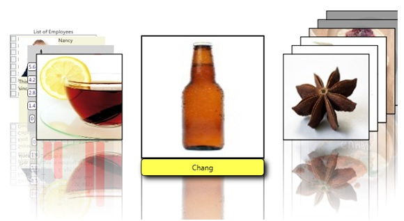

# PileFlowPanel
_Only available in the Plus Edition_

Derives from Panel

PileFlowPanel contains PileFlowItem objects ("flow items"). A [PileFlowItem](PileFlowItem) is responsible for animating its element and can contain any FrameworkElement-derived class.

The [PileFlowCard](PileFlowCard) class is used for displaying content with an optional mirror-like reflection in the PileFlowPanel beneath the content; this class is used in XAML to add elements to PileFlowPanel.

The PileFlowPanel class also contains a label that can be configured to display the PileFlowItem data via the property ContentLabel. When the PileFlowPanel has focus, this sample lets the arrow buttons or the mouse wheel modify the selection.

## Properties
|| Property || Description
| AnimationDuration | Gets or sets the duration of an animation (in ms).
| CanHorizontallyScroll | Gets or sets if the horizontal scrolling is enabled.
| CanVerticallyScroll | Gets or sets if the vertical scrolling is enabled.
| CenterOffsetX | Gets or sets the X offset between the selected item and the other items.
| ContentLabel | Gets or sets the content of the label.
| ContentLabelOffsetY | Gets or sets the Y offset of the label.
| ContentLabelSize | Gets or sets the size of the label.
| ExtendHeight | Gets the Height extended for the panel.
| ExtendWidth | Gets the Width extended for the panel.
| FlowItemHeight | Gets the height of the item beside the selected item.
| FlowItemRatio | Gets or sets the ratio of the items compared to the selected item in percentage.
| FlowItemWidth | Gets the width of the item beside the selected item.
| FlowItemsCount | Gets or sets the items count beside the selected item.
| FlowOffsetX | Gets or sets the X offset between the items beside the selected item.
| FlowOffsetY | Gets or sets the Y offset between the items beside the selected item.
| HorizontalOffset| Gets the horizontal offset for the panel.
| ItemHeight | Gets or sets the height of the selected iem.
| ItemSize | Gets the size of the selected item.
| ItemWidth | Gets or sets the width of the selected item.
| ItemsCount | Gets the total items count.
| LastMoveDecelerationRatio | Gets or sets the ratio of deceleration of last animation.
| ScrollOwner | Gets or sets the ScrollViewer.
| VerticalOffset | Gets the Vertical offset.
| ViewportHeight | Gets the height of the viewport.
| ViewportWidth | Gets the width of the viewport.

## Methods
|| Method || Description
| LineDown() | Sets Vertical offset down by one.
| LineLeft() | Sets Horizontal offset left by one.
| LineUp() | Sets Vertical offset up by one.
| LineRight() | Sets Horizontal offset right by one.
| MakeVisible( Visual visual, Rect rectangle ) | Show a children of the panel.
| MouseWheelDown() | Sets Vertical offset down by SystemParameters.WheelScrollLines.
| MouseWheelLeft() | Sets Horizontal offset left by SystemParameters.WheelScrollLines.
| MouseWheelUp() | Sets Vertical offset up by SystemParameters.WheelScrollLines.
| MouseWheelRight() | Sets Horizontal offset right by SystemParameters.WheelScrollLines.
| MoveLeft() | Move all items to the left of 1 item.
| MoveLeft( int itemsCount ) | Move all items to the left of itemsCount item.
| MoveRight() | Move all items to the right of 1 item.
| MoveRight( int itemsCount ) | Move all items to the right of itemsCount item.
| PageDown() | Sets Vertical offset down by page.
| PageLeft() | Sets Horizontal offset left by page.
| PageUp() | Sets Vertical offset up by page.
| PageRight() | Sets Horizontal offset right by page.
| SelectChild( FrameworkElement child ) | Selects specified element.
| SelectItem( PileFlowItem item ) | Selects specified item.
| SetHorizontalOffset( double offset ) | Sets the Horizontal offset.
| SetVerticalOffset( double offset ) | Sets the Vertical offset.
---