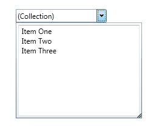

# PrimitiveTypeCollectionEditor
Derives from ContentControl

Represents an editor of primitive types.

## Properties
|| Property || Description
| IsOpen |  Gets or sets a value indicating whether the editor's dropdown is open. 
| IsReadOnly | Gets or sets if the control can be edited.
| ItemsSource | Gets or sets a collection used to generate the content of the control.
| ItemsSourceType | Gets or sets the type of ItemsSource.
| ItemType | Gets the type of the item.
| Text | Gets or sets the text of the editor.

**Support this project, check out the [Plus Edition](https://xceed.com/xceed-toolkit-plus-for-wpf/).**
---