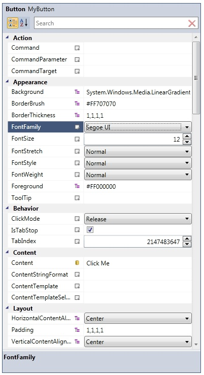
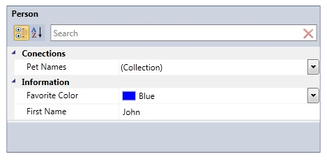
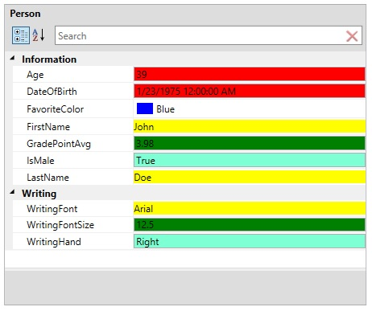
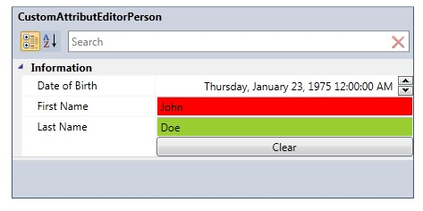
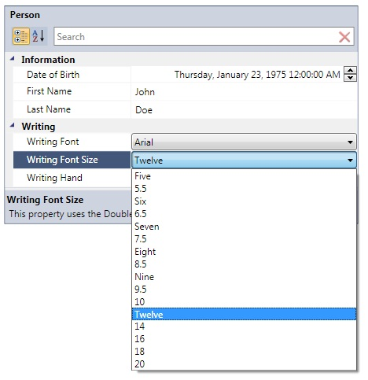
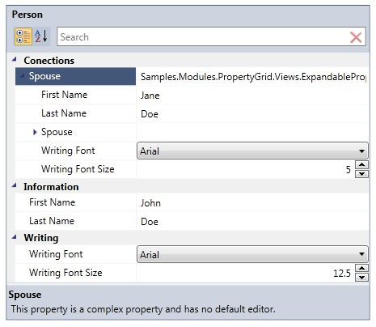

# PropertyGrid
Derives from Control

The PropertyGrid control allows you inspect and edit properties of an object. This PropertyGrid allows you to autogenerate all properties or specify the specific properties you want to display. You can use the standard editors that are provided with the PropertyGrid or you can use custom editors that target a Type, specific properties, or both. The PropertyGrid also supports complex properties, which allows you to drill down into a nested property hierarchy.

* [Specifying Properties](#specifying_properties)
* Custom Editors
	* [DataTemplates](#custom_editors_dataTempates)
	* [Attributes](#custom_editors_attributes)
* [Custom ItemsSource](#custom_itemssource)
* [Expandable Properties](#expandable_properties)

{anchor:specifying_properties}
## Specifying Properties
By default the propertyGrid will autogenerate all the properties for a given object.  You can override this behavior by setting the AutoGenerateProperties property to False, and then provide a collection of PropertyDefinitions of the properties you would like to show.

{{
            <xctk:PropertyGrid x:Name="_propertyGrid" Width="450" Margin="10"
                                     AutoGenerateProperties="False">
                <!-- Only the following properties will be displayed in the PropertyGrid -->
                <xctk:PropertyGrid.PropertyDefinitions>
                    <xctk:PropertyDefinition TargetProperties="FirstName" />
                    <xctk:PropertyDefinition TargetProperties="FavoriteColor" />
                    <xctk:PropertyDefinition TargetProperties="PetNames" />
                </xctk:PropertyGrid.PropertyDefinitions>
            </xctk:PropertyGrid>
}}

## Custom Editors

By default the PropertyGrid comes with 19 built-in editors:
* ByteUpDownEditor 
* CheckBoxEditor 
* CollectionEditor 
* ColorEditor 
* DateTimeUpDownEditor 
* DecimalUpDownEditor 
* DoubleUpDownEditor 
* EnumComboBoxEditor 
* FileEditor (Plus version only)
* FontComboBoxEditor 
* IntegerUpDownEditor 
* ItemsSourceEditor 
* LongUpDownEditor 
* MaskedTextBoxEditor 
* PrimitiveTypeCollectionEditor 
* ShortUpDownEditor 
* SingleUpDownEditor 
* TextBlockEditor 
* TextBoxEditor 
* TimeSpanEditor 
{anchor:custom_editors_dataTempates}
**Custom Editors with DataTemplates**

You can override the default editors with your own custom editors with a DataTemplate.  Simply define an EditorDefinition that either targets a Type, property name, or both and set the EditorDefinition.EditorTemplate to an instance of a DataTemplate.  Be sure to bind your custom editor to the bound property item's Value property.

{{
        <xctk:PropertyGrid x:Name="_propertyGrid" Grid.Row="1" 
                         Width="450" MaxHeight="375" Margin="10"
                         SelectedObject="{Binding}">
            <xctk:PropertyGrid.EditorDefinitions>

               <!--  EditorTemplateDefinition #1
               This EditorTemplateDefinition will provide a green TextBox to:
               1) All properties of type Double
               Replacing the default editor. -->
               <xctk:EditorTemplateDefinition TargetProperties="{x:Type sys:Double}">
                  <xctk:EditorTemplateDefinition.EditingTemplate>
                     <DataTemplate>
                        <TextBox Background="Green"  Text="{Binding Value}" />
                        <!-- 
                        When using SelectedObject[s](s) bind to the "Value" property 
                        
                        When using PropertiesSource or Properties to specify your items,
                        your DataContext will be the item itself, so bind directly to the 
                        property of your underlying item, hence, probably the same path as 
                        the one you specified on the 'PropertyValueBinding'
                        property of your property grid.
                        -->
                     </DataTemplate>
                  </xctk:EditorTemplateDefinition.EditingTemplate>
               </xctk:EditorTemplateDefinition>

               <!--  EditorTemplateDefinition #2
               This EditorTemplateDefinition will provide a yellow TextBox to:
               1) The property named "LastName"
               2) The property named "FirstName"
               3) The property named "Spouse"
               Replacing the default editor. -->
               <xctk:EditorTemplateDefinition TargetProperties="FirstName,LastName,WritingFont">
                  <xctk:EditorTemplateDefinition.EditingTemplate>
                     <DataTemplate>
                        <TextBlock Background="Yellow" Text="{Binding Value}" />
                     </DataTemplate>
                  </xctk:EditorTemplateDefinition.EditingTemplate>
               </xctk:EditorTemplateDefinition>

               <!--  EditorTemplateDefinition #3
               This EditorTemplateDefinition will provide a red TextBox to:
               1) The property named "Age"
               2) All properties of type DateTime
               Replacing the default editor. -->
               <xctk:EditorTemplateDefinition >
                  <xctk:EditorTemplateDefinition.TargetProperties>
                     <sys:String>Age</sys:String>
                     <xctk:TargetPropertyType Type="{x:Type sys:DateTime}" />
                  </xctk:EditorTemplateDefinition.TargetProperties>
                  <xctk:EditorTemplateDefinition.EditingTemplate>
                     <DataTemplate>
                        <TextBox Background="Red" Text="{Binding Value}" />
                     </DataTemplate>
                  </xctk:EditorTemplateDefinition.EditingTemplate>
               </xctk:EditorTemplateDefinition>

               <!--  EditorTemplateDefinition #4
               This EditorTemplateDefinition will provide a aquamarine TextBox to:
               1) All properties of type "bool" (Boolean)
               2) All properties of type HorizontalAlignment
               3) All properties of type FontFamily
               Replacing the default editor. -->
               <xctk:EditorTemplateDefinition >
                  <xctk:EditorTemplateDefinition.TargetProperties>
                     <xctk:TargetPropertyType Type="{x:Type sys:Boolean}" />
                  <xctk:TargetPropertyType Type="{x:Type HorizontalAlignment}" />
                  <xctk:TargetPropertyType Type="{x:Type FontFamily}" />
               </xctk:EditorTemplateDefinition.TargetProperties>
                  <xctk:EditorTemplateDefinition.EditingTemplate>
                     <DataTemplate>
                        <TextBox Background="Aquamarine" Text="{Binding Value}" />
                     </DataTemplate>
                  </xctk:EditorTemplateDefinition.EditingTemplate>
               </xctk:EditorTemplateDefinition>

            </xctk:PropertyGrid.EditorDefinitions>
        </xctk:PropertyGrid>
}}
{anchor:custom_editors_attributes}
**Custom Editors with Attributes**

You can supply editors for a property by using the System.ComponentModel.EditorAttribute.  In order to provide an editor with an attribute, the editor MUST implement the ITypeEditor interface.  Your editor can be a simple class or a complex UserControl.

{{
        public class CustomAttributEditorPerson
        {
            [Category("Information")](Category(_Information_))
            [DisplayName("First Name")](DisplayName(_First-Name_))
            [Description("This property uses a TextBox as the default editor.")](Description(_This-property-uses-a-TextBox-as-the-default-editor._))
            //This custom editor is a Class that implements the ITypeEditor interface
            [Editor(typeof(FirstNameEditor), typeof(FirstNameEditor))](Editor(typeof(FirstNameEditor),-typeof(FirstNameEditor)))
            public string FirstName { get; set; }

            [Category("Information")](Category(_Information_))
            [DisplayName("Last Name")](DisplayName(_Last-Name_))
            [Description("This property uses a TextBox as the default editor.")](Description(_This-property-uses-a-TextBox-as-the-default-editor._))
            //This custom editor is a UserControl that implements the ITypeEditor interface
            [Editor(typeof(LastNameUserControlEditor), typeof(LastNameUserControlEditor))](Editor(typeof(LastNameUserControlEditor),-typeof(LastNameUserControlEditor)))
            public string LastName { get; set; }
        }
}}

Using a custom class:

{{
    //Custom editors that are used as attributes MUST implement the ITypeEditor interface.
    public class FirstNameEditor : Xceed.Wpf.Toolkit.PropertyGrid.Editors.ITypeEditor
    {
        public FrameworkElement ResolveEditor(Xceed.Wpf.Toolkit.PropertyGrid.PropertyItem propertyItem)
        {
            TextBox textBox = new TextBox();
            textBox.Background = new SolidColorBrush(Colors.Red);

            //create the binding from the bound property item to the editor
            var _binding = new Binding("Value"); //bind to the Value property of the PropertyItem
            _binding.Source = propertyItem;
            _binding.ValidatesOnExceptions = true;
            _binding.ValidatesOnDataErrors = true;
            _binding.Mode = propertyItem.IsReadOnly ? BindingMode.OneWay : BindingMode.TwoWay;
            BindingOperations.SetBinding(textBox, TextBox.TextProperty, _binding);
            return textBox;
        }
    }
}}

Using a UserControl:

{{
<UserControl x:Class="Samples.Modules.PropertyGrid.LastNameUserControlEditor"
             xmlns="http://schemas.microsoft.com/winfx/2006/xaml/presentation"
             xmlns:x="http://schemas.microsoft.com/winfx/2006/xaml"
             x:Name="_uc">
        <StackPanel>
            <TextBox Text="{Binding Value, ElementName=_uc}" Background="YellowGreen"  />
            <Button Click="Button_Click">Clear</Button>
        </StackPanel>
</UserControl>
}}

{{
    public partial class LastNameUserControlEditor : UserControl, ITypeEditor
    {
        public LastNameUserControlEditor()
        {
            InitializeComponent();
        }

        public static readonly DependencyProperty ValueProperty = DependencyProperty.Register("Value", typeof(string), typeof(LastNameUserControlEditor), 
                                                                                                new FrameworkPropertyMetadata(null, FrameworkPropertyMetadataOptions.BindsTwoWayByDefault));
        public string Value
        {
            get { return (string)GetValue(ValueProperty); }
            set { SetValue(ValueProperty, value); }
        }        

        private void Button_Click(object sender, RoutedEventArgs e)
        {
            Value = string.Empty;
        }

        public FrameworkElement ResolveEditor(Xceed.Wpf.Toolkit.PropertyGrid.PropertyItem propertyItem)
        {
            Binding binding = new Binding("Value");
            binding.Source = propertyItem;
            binding.Mode = propertyItem.IsReadOnly ? BindingMode.OneWay : BindingMode.TwoWay;
            BindingOperations.SetBinding(this, LastNameUserControlEditor.ValueProperty, binding);
            return this;
        }
    }
}}
{anchor:custom_itemssource}
##  Custom ItemsSource
Sometimes it is desirable to want to provide a collection of values represented by a ComboBox for a given property.  The PropertyGrid supports this scenario by creating a class that implements the IItemsSource interface and decorating your property with the ItemsSourceAttribute.

{{
        public class Person
        {
            [Category("Writing")](Category(_Writing_))
            [DisplayName("Writing Font Size")](DisplayName(_Writing-Font-Size_))
            [Description("This property uses the DoubleUpDown as the default editor.")](Description(_This-property-uses-the-DoubleUpDown-as-the-default-editor._))
            [ItemsSource(typeof(FontSizeItemsSource))](ItemsSource(typeof(FontSizeItemsSource)))
            public double WritingFontSize { get; set; }
        }
}}
The custom ItemsSource class:

{{
    public class FontSizeItemsSource : IItemsSource
    {
        public ItemCollection GetValues()
        {
            ItemCollection sizes = new ItemCollection();
            sizes.Add(5.0, "Five");
            sizes.Add(5.5);
            sizes.Add(6.0, "Six");
            sizes.Add(6.5);
            sizes.Add(7.0, "Seven");
            sizes.Add(7.5);
            sizes.Add(8.0, "Eight");
            sizes.Add(8.5);
            sizes.Add(9.0, "Nine");
            sizes.Add(9.5);
            sizes.Add(10.0);
            sizes.Add(12.0, "Twelve");
            sizes.Add(14.0);
            sizes.Add(16.0);
            sizes.Add(18.0);
            sizes.Add(20.0);
            return sizes;
        }
    }
}}
{anchor:expandable_properties}
## Expandable Properties
Sometimes it is neccessary to show the properties of a complex object.  The PropertyGrid supports this scenario and allows you to drill down into a property's heirarchy.  To enable this behavior you must decorate your property with the ExpandableObject attribute.

{{
        public class Person
        {
            [Category("Information")](Category(_Information_))
            [DisplayName("First Name")](DisplayName(_First-Name_))
            [Description("This property uses a TextBox as the default editor.")](Description(_This-property-uses-a-TextBox-as-the-default-editor._))
            public string FirstName { get; set; }

            [Category("Conections")](Category(_Conections_))
            [Description("This property is a complex property and has no default editor.")](Description(_This-property-is-a-complex-property-and-has-no-default-editor._))
            [ExpandableObject](ExpandableObject)
            public Person Spouse { get; set; }
        }
}}

## Properties
|| Property || Description
| AdvancedOptionsMenu | Gets/Sets the contextual menu to use when the advanced menu button is clicked.
| AutoGenerateProperties | Get/Sets if the propertyGrid should generate all properties for a given object. If False you must provide PropertyDefinitions for the properties you want to generate.
| EditorDefinitions| Get/Sets a collection of custom editors to use in place of the default editors. (Breaking change as of v1.6.0: previously was CustomTypeEditors.)
| Filter | Gets/Sets the filter used to filter the visible properties in the PropertyGrid.
| FilterWatermark | Gets/Sets the watermark used in the filter field.
| HideInheritedProperties | Gets or sets if the Inherited properties of the selected object will be hidden. Default is False.
| IsCategorized | Gets/Sets the layout of the PropertyGrid.
| IsReadOnly | Gets or sets a value indicating whether the property grid is read-only.
| NameColumnWidth | Gets/Sets the width of the property name column.
| Properties | Gets the current collection of generated PropertyItems.
| PropertyDefinitions | When **AutoGenerateProperties** = False, gets/sets the properties that will be generated by the PropertyGrid
| SelectedObject | Gets/Sets the current object the PropertyGrid is inspecting,
| SelectedObjectName | Gets/Sets the **SelectedObject** name.
| SelectedObjectType | Gets/Sets the Type of the **SelectedObject**.
| SelectedObjectTypeName | Gets/Sets the name of the Type of the **SelectedObject**.
| SelectedProperty | Gets or sets the selected property or returns null if the selection is empty.
| SelectedPropertyItem | Gets the currently selected PropertyItem
| ShowAdvancedOptions | Gets/Sets the visibility of the advanced options button next to the properties.
| ShowPreview | Gets or sets if the preview of the control is displayed
| ShowDescriptionByTooltip | Gets/Sets if the Description of the PropertyItem will be displayed as a tooltip on the PART_Name of the PropertyItem. When ShowDescriptionByTooltip is True and the DescriptionAttribute on the PropertyItem is not null and not empty, it will be displayed as a tooltip.
| ShowSearchBox | Gets/Sets a value indicating whether the search box is displayed. By default, true.
| ShowSortOptions | Gets/Sets a value indicating whether the show sort options are displayed (Categorized and Alphabetical). By default, true.
| ShowSummary | Gets or sets a value indicating whether the summary pane is shown.
| ShowTitle | Gets or sets a value indicating whether the PropertyGrid's title is displayed.
| UpdateTextBoxSourceOnEnterKey | Gets or sets if the source of the propertItem represented by a TextBox will be updated when Enter key is pressed.

## Events
|| Event || Description
| ClearPropertyItem | This event is raised when an property item is about to be remove from the display in the PropertyGrid. This allow the user to remove any attached handler in the PreparePropertyItem event.
| PreparePropertyItem | This event is raised when a property item is about to be displayed in the PropertyGrid. This allow the user to customize the property item just before it is displayed.
| PropertyValueChanged  | Raised when a property's value changes.
| SelectedObjectChanged | Raised when SelectedObject changes.
| SelectedPropertyItemChanged | Raised when SelectedProperty changes.

**Support this project, check out the [Plus Edition](https://xceed.com/xceed-toolkit-plus-for-wpf/).**
---