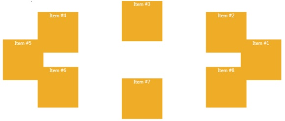

# RadialCanvas
_Only available in the Plus Edition_

Derives from AnimationPanel

Lays out its children in a circle based on panel size and/or properties set.

## Properties
|| Property || Description
| * | All the Properties from [Canvas](Canvas) Panel
| Angle (attached) | Gets or sets the angle for a children.
| Center | Gets or sets a relative center for the radial. Valid values are 0 to 1.0 where .5 means center of the panel.
| IsAutoArrange | Gets or sets the IsAutoArrange property. This dependency property indicates if angles are automaticaly computed based on number of children.
| PinPoint (attached) | Gets or sets the PinPoint for a children.
| Radius (attached) | Gets or sets the radius for a children.

## Events
|| Event || Description
| * | All the Events from [Canvas](Canvas) Panel.
---