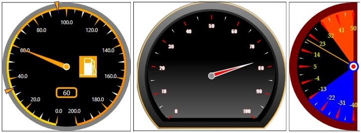

# RadialGauge
_Only available in the Plus Edition_

Derives from Control

The main class for the gauge control. Setting the Value property will make the pointer point toward that value along the RadialGauge's circumference.

## Properties
|| Property || Description
| ActualValue | Gets the current Value of the RadialGauge regardless of whether the pointer is at rest or animating.  
| BackgroundImage | Gets or sets the image to display within the RadialGauge.  
| BackgroundImageOffsetX | Gets or sets the X offset of the BackgroundImage displayed in the RadialGauge.  
| BackgroundImageOffsetY | Gets or sets the Y offset of the BackgroundImage displayed in the RadialGauge.  
| BGPortions | Gets or sets the Collection of Background GaugePortions.  
| BorderPortions | Gets or sets the collection of Border portions of the RadialGauge.  
| EndAngle | Gets or sets the end angle of the RadialGauge, in degrees. Angle 0 is the top, 90 is the right, 180 is the bottom and 270 is the left.  
| Fill | Gets or sets the brush that is used to fill the RadialGauge's background.  
| IsFullCircleBackground | Gets or sets whether or not the RadialGauge will be represented as a full circle, even if the StartAngle and EndAngle do not give a 360 degree gauge.  
| IsNumericIndicatorVisible | Gets or sets if the NumericIndicator is displayed.  
| IsPointerCapVisible | Gets or sets if the pointer cap at the center of the gauge is displayed.  
| IsPointerVisible | Gets or sets if the gauge's pointer is displayed.  
| IsTickLabelRotated | Gets or sets if the label on the MajorTicks will be rotated to follow the tangent of its position along the circumference of the RadialGauge.  
| IsTickLabelVisible | Gets or sets if the label on the MajorTicks is displayed. The labels are the numbers of the scale shown on the RadialGauge.  
| IsTickMarkVisible | Gets or sets if the marks of the Ticks will be visible. A tick is composed of a mark and a label. The label is the numeric graduation value shown. The mark is the line on the scale of the RadialGauge.  
| MajorTickCount | Gets or sets the count of MajorTicks on the RadialGauge. MajorTicks are the main tick marks of the RadialGauge.  
| MajorTickCustomLabels | Gets or sets the major tick labels in the RadialGauge. For example, when you want to display 'North', 'South', 'East', 'West' instead of numeric values, you can fill this property with the string value "North,South,East,West". Starting from the first MajorTick, the MajorTick labels will be replaced with the comma-separated substrings.  
| MajorTickLabelTemplate | Gets or sets the DataTemplate to be used for the MajorTick Labels.  
| MajorTickLabelOffset | Gets or sets the offset of the MajorTick labels from the center of the RadialGauge. A positive value will push the markers away from center while a negative value will pull them toward the center of the RadialGauge.  
| MajorTickMarkTemplate | Gets or sets the DataTemplate to be used for the MajorTick marks. The new MajorTickMarkTemplate needs to be defined inside, at top-left, of a rectangle with (0,0) for top-left and (x,x) for bottom right.  
| MiddleTickCount | Gets or sets the count of MiddleTick divisions in the RadialGauge. MiddleTicks are divisions in between MajorTicks on the RadialGauge. A tick shape will be displayed between each division. To clarify, MiddleTicks counts the number of divisions created between MajorTicks, not the number of actual tick shapes displayed. To display 1 tick shape, set MiddleTickCount to 2. Setting MiddleTickCount to 1 will not display any tick shapes for the major ticks.  
| MiddleTickMarkTemplate | Gets or sets the DataTemplate to be used for the MiddleTick marks. The new MiddleTickMarkTemplate needs to be defined inside, at top-left, of a rectangle with (0,0) for top-left and (x,x) for bottom right.  
| MinorTickCount | Gets or sets the count of MinorTick divisions in the RadialGauge. MinorTicks are divisions in between MiddleTicks and MajorTicks on the RadialGauge. A tick shape will be displayed between each division. To clarify, MinorTicks counts the number of divisions created between MajorTicks and MiddleTicks, not the number of actual tick shapes displayed. To display 1 tick shape, set MinorTickCount to 2. Setting MinorTickCount to 1 will not display any tick shapes between the major ticks and middle ticks.
| MinorTickMarkTemplate | Gets or sets the DataTemplate to be used for the MinorTick marks. The new MinorTickMarkTemplate needs to be defined inside, at top-left, of a rectangle with (0,0) for top-left and (x,x) for bottom right. 
| MarkerOffset | Gets or sets the offset to use for Markers on the RadialGauge. A positive value will push the markers away from center while a negative value will pull them toward the center of the RadialGauge.  
| Markers | Gets or sets the collection of markers in the RadialGauge. Markers represent marks along the RadialGauge to identify important Values.  
| MarkersTemplate | Gets or sets the DataTemplate to be used for the Markers. The new MarkerDataTemplate needs to be defined inside, at top-left, of a rectangle with (0,0) for top-left and (x,x) for bottom right.  
| Maximum | Gets or sets the maximum value of the scale of the RadialGauge.  
| Minimum | Gets or sets the minimum value of the scale of the RadialGauge.  
| NumericIndicatorOffsetX | Gets or sets the X offset of the NumericIndicator. A positive value will move the NumericIndicator to the right while a negative value will move it to the left.  
| NumericIndicatorOffsetY | Gets or sets the Y offset of the NumericIndicator. A positive value will move the NumericIndicator down while a negative value will move it up.  
| NumericIndicatorTemplate | Gets or sets the DataTemplate to be used for the NumericIndicator.  
| PointerCapStyle | Gets or sets the Style to be used for the PointerCap.  
| PointerOffset | Gets or sets the offset from the center to display the Pointer from. A positive value will push the Pointer away from center while a negative value will pull it toward the center of the RadialGauge.
| PointerTemplate | Gets or sets the DataTemplate to be used for the Pointer. The new PointerDataTemplate needs to be defined inside, at top-left, of a rectangle with (0,0) for top-left and (x,x) for bottom right. The Pointer should be pointing straight up.
| PointerTooltipTemplate | Gets or sets the DataTemplate to be used for the tooltip of the Pointer.  
| StartAngle | Gets or sets the start angle of the RadialGauge, in degrees. Angle 0 is the top, 90 is the right, 180 is the bottom and 270 is the left.  
| Stroke | Gets or sets the brush to use for the stroke of the RadialGauge. The stroke is the border drawn around the gauge.  
| StrokeThickness | Gets or sets the Thickness of the stroke on the RadialGauge.  
| SweepDirection | Gets or sets the direction to draw the RadialGauge between StartAngle and EndAngle, either ClockWise or CounterClockWise.  
| TickMarkOffset | Gets or sets the offset to be used for the gauge's tick marks. A positive value will move the tick marks away from center while a negative value will move them toward the center of the radialGauge.  
| Value | Gets or sets the value of the RadialGauge. The Pointer will point to or animate towards this value.  
| ValueAnimation | Gets or sets the animation that will be used for the pointer when the RadialGauge's Value property is modified. Animation types include None, Linear, BackEase, PowerEase, ElasticEase, and BounceEase.  
---