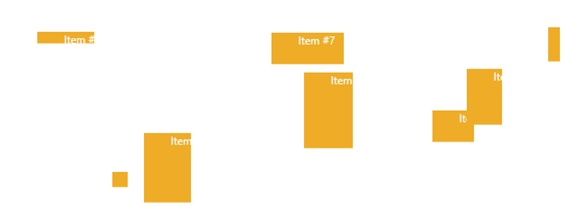

# RandomPanel
Derives from AnimationPanel

The RandomPanel control lays out its children with a random location and size.

## Usage

**XAML**

{{
        <xctk:SwitchPanel x:Name="_switchPanel" Grid.Row="1" ActiveLayoutIndex="{Binding ElementName=layoutCombo, Path=SelectedIndex}" ActiveLayoutChanged="OnSwitchPanelLayoutChanged">
            <xctk:SwitchPanel.Layouts>
               <xctk:WrapPanel x:Name="_wrapPanel" ItemWidth="100" ItemHeight="100"/>
               <xctk:RandomPanel x:Name="_randomPanel" />
            </xctk:SwitchPanel.Layouts>
            <TextBlock x:Name="_item1" Text="Item #1" Style="{StaticResource panelElement}"/>
            <TextBlock x:Name="_item2" Text="Item #2" Style="{StaticResource panelElement}"/>
            <TextBlock x:Name="_item3" Text="Item #3" Style="{StaticResource panelElement}"/>
            <TextBlock x:Name="_item4" Text="Item #4" Style="{StaticResource panelElement}"/>
            <TextBlock x:Name="_item5" Text="Item #5" Style="{StaticResource panelElement}"/>
            <TextBlock x:Name="_item6" Text="Item #6" Style="{StaticResource panelElement}"/>
            <TextBlock x:Name="_item7" Text="Item #7" Style="{StaticResource panelElement}"/>
            <TextBlock x:Name="_item8" Text="Item #8" Style="{StaticResource panelElement}"/>
         </xctk:SwitchPanel>
}}
## Properties
|| Property || Description
| DefaultAnimationRate | Gets or sets the DefaultAnimationRate property. This dependency property indicates the duration or speed at which other animations will if they set their respective AnimationRate properties to AnimationRate.Default. This property can be used to set a single animation rate to be used for EnterAnimationRate, ExitAnimationRate, LayoutAnimationRate, SwitchAnimationRate, and TemplateAnimationRate. (Inherited from Xceed.Wpf.Toolkit.Panels.AnimationPanel)
| DefaultAnimator | Gets or sets the EnterAnimator property. This dependency property indicates which iterative layout animator will be used to animate children when they are first added to a panel. This provides for an "animate in" effect. If you'd like to use the same animator for several layouts within a SwitchPanel, you can set the EnterAnimator property directly on the owning SwitchPanel. Otherwise, setting this property on an animation panel will override the value of the owning SwitchPanel. (Inherited from Xceed.Wpf.Toolkit.Panels.AnimationPanel)
| DesiredSize | (Inherited from Xceed.Wpf.Toolkit.Panels.AnimationPanel)
| EnterAnimationRate | Gets or sets the EnterAnimationRate property. This dependency property indicates the duration or speed at which "enter" animations occur within the panel. If null is specified and the panel belongs to the Layouts collection of a SwitchPanel, then the EnterAnimationRate property of the SwitchPanel will be used. If null is specified and the panel is being used standalone, then a default speed of 1 will be used. To prevent animations within the panel, you can explicitly set the speed property to 0 or simply set the IsAnimated property to false. (Inherited from Xceed.Wpf.Toolkit.Panels.AnimationPanel)
| EnterAnimator | Gets or sets the EnterAnimator property. This dependency property indicates which iterative layout animator will be used to animate children when they are first added to a panel. This provides for an "animate in" effect. If you'd like to use the same animator for several layouts within a SwitchPanel, you can set the EnterAnimator property directly on the owning SwitchPanel. Otherwise, setting this property on an animation panel will override the value of the owning SwitchPanel. (Inherited from Xceed.Wpf.Toolkit.Panels.AnimationPanel)
| ExitAnimationRate | Gets or sets the ExitAnimationRate property. This dependency property indicates the duration or speed at which "exit" animations occur within the panel. If null is specified and the panel belongs to the Layouts collection of a SwitchPanel, then the ExitAnimationRate property of the SwitchPanel will be used. If null is specified and the panel is being used standalone, then a default speed of 1 will be used. To prevent animations within the panel, you can explicitly set the speed property to 0 or simply set the IsAnimated property to false. (Inherited from Xceed.Wpf.Toolkit.Panels.AnimationPanel)
| ExitAnimator | Gets or sets the ExitAnimator property. This dependency property indicates which iterative layout animator will be used to animate children when they are removed from a panel. This provides for an "animate out" effect. If you'd like to use the same animator for several layouts within a SwitchPanel, you can set the ExitAnimator property directly on the owning SwitchPanel. Otherwise, setting this property on an animation panel will override the value of the owning SwitchPanel. (Inherited from Xceed.Wpf.Toolkit.Panels.AnimationPanel)
| IsActiveLayout | Gets if current layout is active. (Inherited from Xceed.Wpf.Toolkit.Panels.AnimationPanel)
| LayoutAnimationRate | Gets or sets the LayoutAnimationRate property. This dependency property indicates the duration or speed at which animations occur within the panel. If null is specified and the panel belongs to the Layouts collection of a SwitchPanel, then the LayoutAnimationRate property of the SwitchPanel will be used. If null is specified and the panel is being used standalone, then a default speed of 1 will be used. To prevent animations within the panel, you can explicitly set the speed property to 0 or simply set the IsAnimated property to false. (Inherited from Xceed.Wpf.Toolkit.Panels.AnimationPanel)
| LayoutAnimator | Gets or sets the LayoutAnimator property. This dependency property indicates which iterative layout animator will be used to animate children whenever a layout pass arranges the children to a new location. If the LayoutAnimator property is null, then a linear animator will be used for layout animations. To prevent layout animations, you can set the IsAnimated property to false. If you'd like to use the same animator for several layouts within a SwitchPanel, you can set the LayoutAnimator property directly on the owning SwitchPanel. Otherwise, setting this property on an animation panel will override the value of the owning SwitchPanel. (Inherited from Xceed.Wpf.Toolkit.Panels.AnimationPanel)
| MaximumHeight | Gets or sets the MaximumHeight property. This dependency property indicates maximum height of a child.  
| MaximumWidth | Gets or sets the MaximumWidth property. This dependency property indicates the maximum width of a child.  
| MinimumHeight | Gets or sets the MinimumHeight property. This dependency property indicates th minimum height of a child.  
| MinimumWidth | Gets or sets the MinimumWidth property. This dependency property indicates the minimum width of a child  
| RenderSize | (Inherited from Xceed.Wpf.Toolkit.Panels.AnimationPanel)
| Seed | A number used to seed the Random object that generates the random numbers for the panel.  
| SwitchAnimationRate | Gets or sets the SwitchAnimationRate property. This dependency property indicates the duration or speed at which "switch" animations occur within the panel. If null is specified and the panel belongs to the Layouts collection of a SwitchPanel, then the SwitchAnimationRate property of the SwitchPanel will be used. If UnsetValue is specified and the panel is being used standalone, then a default speed of 1 will be used. To prevent animations within the panel, you can explicitly set the speed property to 0 or simply set the IsAnimated property to false. !!! fix these descriptions (Inherited from Xceed.Wpf.Toolkit.Panels.AnimationPanel)
| SwitchAnimator | Gets or sets the SwitchAnimator property. This dependency property indicates the animator that will be used for layout switches when the AnimationPanel belongs to the Layouts collection of a SwitchPanel. If the SwitchAnimator property is null, then the LayoutAnimator will be used for both layout animations and switch animations. To prevent switch animations, you can set the AreLayoutSwitchesAnimated property on the owning SwitchPanel to false. If you'd like to use the same animator for all layout switches, you can set the SwitchAnimator property on the owning SwitchPanel. (Inherited from Xceed.Wpf.Toolkit.Panels.AnimationPanel)
| SwitchParent | Gets the SwitchParent property. This dependency property indicates the parent SwitchPanel (if the current SwitchablePanel is a member of a Layouts collection). (Inherited from Xceed.Wpf.Toolkit.Panels.AnimationPanel)
| SwitchTemplate | Gets or sets the SwitchTemplate property. This dependency property indicates the DataTemplate that should be used for SwitchPresenter elements within the SwitchParent's visual tree while the panel is the active layout of the SwitchParent. (Inherited from Xceed.Wpf.Toolkit.Panels.AnimationPanel)
| TemplateAnimationRate | Gets or sets the TemplateAnimationRate property. This dependency property indicates the duration or speed at which ID'd elements within a SwitchTemplate are animated during a template switch. If null is specified and the panel belongs to the Layouts collection of a SwitchPanel, then the TemplateAnimationRate property of the SwitchPanel will be used. If UnsetValue is specified and the panel is being used standalone, then a default speed of 1 will be used. To prevent animations within the panel, you can explicitly set the speed property to 0 or simply set the IsAnimated property to false. (Inherited from Xceed.Wpf.Toolkit.Panels.AnimationPanel)
| TemplateAnimator | Gets or sets the TemplateAnimator property. This dependency property indicates the animator that will be used for layout switches when the AnimationPanel belongs to the Layouts collection of a SwitchPanel. If the TemplateAnimator property is null, then the LayoutAnimator will be used for both layout animations and switch animations. To prevent switch animations, you can set the AreLayoutSwitchesAnimated property on the owning SwitchPanel to false. If you'd like to use the same animator for all layout switches, you can set the TemplateAnimator property on the owning SwitchPanel. (Inherited from Xceed.Wpf.Toolkit.Panels.AnimationPanel)

## Events
|| Event || Description
| AnimationBegun | Raised when the animation has started.
| AnimationCompleted | Raised when the animation is completed.
| ChildEntered | Raised when a child has entered the panel.
| ChildEntering | Raised when a child is entering the panel.
| ChildExited | Raised when a child has exit the panel.
| ChildExiting | Raised when a child is exiting the panel.
| SwitchLayoutActivated | Raised when the layout gets activated.
| SwitchLayoutDeactivated | Raised when the layout gets deactivated.

**Support this project, check out the [Plus Edition](http://wpftoolkit.com).**
---