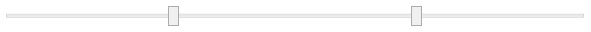

# RangeSlider
Derives from Control

The RangeSlider control lets you set a range with 2 slider thumbs. The lower limit is marked with the right side of the left thumb while the higher limit is marked with the left side of the right thumb.

## Properties
|| Property || Description
| HigherRangeBackground | Gets or sets the Brush for the HigherRange area.
| HigherRangeStyle | Gets or sets the Style for the HigherRange area.
| HigherRangeWidth | Gets the percentage of the size of the HigherRange area within the entire min/max range. The higher range area is the area on the slider that is drawn between the higher thumb and the slider's Maximum.
| HigherThumbBackground | Gets or sets the Brush for the HigherValue thumb.
| HigherValue | Gets or sets the current higher value.
| LowerRangeBackground | Gets or sets the Brush for the LowerRange area.
| LowerRangeStyle | Gets or sets the Style for the LowerRange area.
| LowerRangeWidth | Gets the percentage of the size of the LowerRange area within the entire min/max range. The lower range area is the area on the slider that is drawn between the slider's Minimum and the lower thumb.
| LowerThumBackground | Gets or sets the Brush for the LowerValue thumb.
| LowerValue | Gets or sets the current lower value.
| Maximum | Gets or sets the maximum value of the input range.
| Minimum | Gets or sets the minimum value of the input range.
| Orientation | Gets or sets the orientation used by the RangeSlider.
| RangeBackground | Gets or sets the Brush for the selected range area.
| RangeStyle | Gets or sets the Style for the selected range area.
| RangeWidth | Gets the percentage of the size of the selected range area within the entire min/max range. The selected range area is the area on the slider that is drawn between the lower and higher thumbs.
| Step | Gets or sets the step size (increase/decrease amount) used by the sliders. Used when the user clicks in the range areas (not the thumbs). Not used when interactively dragging the thumbs.

## Events
|| Event || Description
| HigherValueChanged | Raised when the **HigherValue** has been changed.
| LowerValueChanged | Raised when the **LowerValue** has been changed.

**Support this project, check out the [Plus Edition](https://xceed.com/xceed-toolkit-plus-for-wpf/).**
---