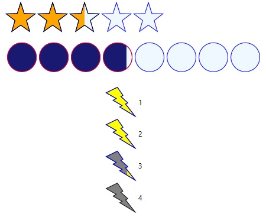

# Rating
_Only available in the Plus Edition_

Derives from ItemsControl

Setting the Value property will highlight the corresponding RatingItem icons.

## Properties
|| Property || Description
| ActiveBorderControl | Gets or sets the Brush for the outer border (Stroke) of the icons that are in the active state.
| ActiveFillColor | Gets or sets the Brush to use to fill in the interior area of icons that are in the active state.
| CustomPath | Gets or sets the custom path for the icons to use.
| FillDirection | Gets or sets the direction of the fill used by the Rating control. This useful when Precision is set to Half or Exact. You can have the icons fill from left to right, top to bottom, and other directions. Please note, this is independent of the Orientation that determines the direction icons are drawn next to each other.
| IconHeight | Gets or sets the height of the icons, in pixels.
| IconPadding | Gets or sets the padding between each icon.
| IconStrokeThickness | Gets or sets the icon border's Stroke thickness. The Stroke represents the outer border.
| InactiveBorder | Gets or sets the Brush for the outer border of icons that are in the inactive state.
| InactiveFillColor | Gets or sets the Brush for the outer border of icons that are in the inactive state.
| ItemsCount | Gets or sets the total number of icons.
| HoverBorderColor | Gets or sets the Brush for the outer border of icons that are in the hover state.
| HoverFillColor | Gets or sets the Brush for the outer border of icons that are in the hover state.
| IconType | Gets or sets the predefined or custom shape used to draw the icons.
| LabelPosition | Gets or sets the position of the labels with respect to the their associated icons. If set to Before, The label will appear above (Horizontal Orientation) or to the left (Vertical Orientation) of the icon. If set toAfter, the label will appear under (Horizontal Orientation) or to the right (Vertical Orientation) of the icon.
| Precision | Gets or sets a value representing the type of precision to use.  When set to Full, icons are never partially filled. They can either be filled or not. When set to Exact, icons will be partially filled to try to exactly represent the Rating control's Value property.When set to Half, the can be filled, half filled, or not filled at all, rounded up. For example, if ItemCount is 5, and the Value is 2.1, then the first two icons will be fully filled, and the third will be half filled.
| Orientation | Gets or sets the orientation of the icons. This determines the direction that icons are drawn next to each other. Use FillDirection to determine afterwards if you want the icons to go from left to right, right to left, top to bottom, or bottom to top.
| ReadOnly | Gets or sets a value indicating whether the input control is read-only.
| ShowLabels | Gets or sets if the labels should be displayed.
| ShowValueTooltip | Gets or sets if the value tooltip should be displayed.
| Value | Gets or sets the current rating value.
| ValueType | Gets or sets the type of value used. When set to Exact, the Rating’s Value will represent the exact icon value. For example, a value of 3 would mean that the first 3 icons are filled, no matter how many icons there are in total. When set to Percentage, the Rating’s Value represents a percentage value (Min=0.0, Max = 1.0). For example, a value of 0.50 would mean that the first 50% is filled (if the Rating control has 5 stars, then the Value would represent the first 3.5 icons).

## Events
|| Event || Description
| RatingValueChanged | Raised when the Value has been changed.
---