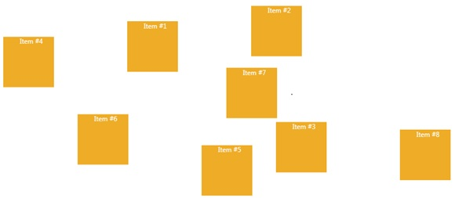

# RelativeCanvas
_Only available in the Plus Edition_

Derives from AnimationPanel

A Panel which is similar to Canvas but it lays out its children relative to the panel's height and width.

## Properties
|| Property || Description
| * | All the Properties from [Canvas](Canvas) Panel
| Left (attached) | Gets or sets the Left property.
| PinPoint (attached) | Gets or sets the PinPoint property.
| RelativeHeight (attached) | Gets or sets the RelativeHeight property.
| RelativeWidth (attached) | Gets or sets the RelativeWidth property.
| Top (attached) | Gets or sets the Top property.

## Events
|| Event || Description
| * | All the Events from [Canvas](Canvas) Panel.
---