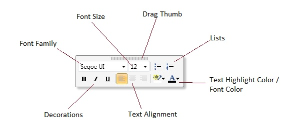

# RichTextBoxFormatBar
Derives from Control

The RichTextBoxFormatBar is a contextual formtting toolbar that mimics the behavior of the Microsoft Office 2010 formatting bar.  It can be attached to any Richtextbox control by using the RichTextBoxFormatBarManager.  You can even create your own formatting bar and use it instead, but still have all the functionality the RichTextboxFormatBarManager provides.

* [Behavior](#behavior)
* [Usage](#usage)
* [Create Your Own Format Bar](#create)
* [Properties](#properties)
* [Methods](#methods)

{anchor:behavior}
## Behavior

The RichTextBoxFormatBar is a contextual text formatting toolbar that will apply text transformations to the selected text of a RichTextBox control.  When the user is in the process of a selection, the RichTextBoxFormatBar will appear when the mouse is released after the selection.  The RichTextBoxFormatBar will also appear during the last click of a "double-click" selection.  While the RichTextFormatBar is shown, you may click on any number of text transformations to be applied to the selected text.  When done, you may click anywhere else in the RichTextBox control or move your mouse outside of the RichTextBox control to hide the RichTextBoxFormatBar.  You can also drag the RichTextBoxFormatBar to a different position if it shows in a position that is not desired by clicking and holding on the drag thumb and moving your mouse to the desired location.

{anchor:usage}
## Usage

You can add the RichTextBoxFormatBar to either the toolkit's RichTextBox or the default Windows RichTextBox.  This is done by using the RichTextBoxFormatBarManager.  You simply set the RichTextBoxFormatBarManager.FormatBar property to the desired IRichTextBoxFormatBar instance.  The following snippet addsthe RichTextBoxFormatBar to the Entended WPF Toolit's RichTextBox.

{{
<xctk:RichTextBox>
       <xctk:RichTextBoxFormatBarManager.FormatBar>
           <xctk:RichTextBoxFormatBar />
       </xctk:RichTextBoxFormatBarManager.FormatBar>
</xctk:RichTextBox>
}}

The following snippet addsthe RichTextBoxFormatBar to the default Windows RichTextBox.

{{
<RichTextBox>
       <xctk:RichTextBoxFormatBarManager.FormatBar>
           <xctk:RichTextBoxFormatBar />
       </xctk:RichTextBoxFormatBarManager.FormatBar>
</RichTextBox>
}}

{anchor:create}
## Create Your Own Format Bar
You create your own custom format bar by creating a custom/user control that implements the IRichTextBoxFormatBar interface and set the RichTextBoxFormatBarManager.FormatBar property to your new custom format bar instance.

{{
<RichTextBox>
       <xctk:RichTextBoxFormatBarManager.FormatBar>
           <local:MyCustomFormatBar />
       </xctk:RichTextBoxFormatBarManager.FormatBar>
</RichTextBox>
}}

{anchor:properties}
## Properties
|| Property || Description
| FontSizes | Gets an array of font sizes.
| Target | Gets or sets the target RichTextBox.

{anchor:methods}
## Methods
|| Method || Description
| PreventDisplayFadeOut | Returns true if the RichTextBoxFormatBar is in a non-fading state.
| Update | Updates the RichTextBoxFormatBar.

**Support this project, check out the [Plus Edition](https://xceed.com/xceed-toolkit-plus-for-wpf/).**
---