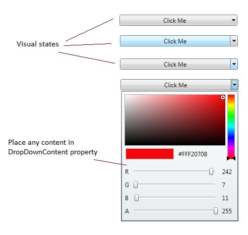

# SplitButton
Derives from Xceed.Wpf.Toolkit.DropDownButton

The SplitButton control is a button that can be clicked and also provides a drop down in which you can place any custom content within. 

{{
        <xctk:SplitButton Content="Click Me">
            <xctk:SplitButton.DropDownContent>
                <xctk:ColorCanvas />
            </xctk:SplitButton.DropDownContent>
        </xctk:SplitButton>
}}

## Properties
|| Property || Description
| Command | Gets or sets the command to execute when the button is clicked.
| CommandParameter | Gets or sets the command parameter to pass to the **Command** when the button is clicked.
| CommandTarget | Gets or sets the element on which to raise the specified command.
| DropDownContent | Get or sets the object to use as the drop down button's content. (Inherited from DropDownButton)
| IsOpen | Gets or sets a value indicating whether the dropdown is open. (Inherited from DropDownButton)

## Events
|| Event || Description
| Click | Raised when the control is clicked (Inherited from DropDownButton)
| Opened | Raised when the DropDownButton dropdown has opened. (Inherited from DropDownButton)
| Closed | Raised when the DropDownButton dropdown has closed. (Inherited from DropDownButton)

**Support this project, check out the [Plus Edition](https://xceed.com/xceed-toolkit-plus-for-wpf/).**
---