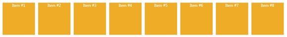

# StackPanel
_Only available in the Plus Edition_

Derives from AnimationPanel

Exactly like WPF's native StackPanel, except this panel can animate its children and be used inside SwitchPanel.

## Properties
|| Property || Description
| * | All the Properties from [Canvas](Canvas) Panel
| CanHorizontallyScroll | Gets or sets if the horizontal scrolling is enabled.
| CanVerticallyScroll | Gets or sets if the vertical scrolling is enabled.
| ExtendHeight | Gets the Height extended for the panel.
| ExtendWidth | Gets the Width extended for the panel.
| HorizontalOffset | Gets the horizontal offset for the panel.
| Orientation | Gets or sets the Orientation property. This dependency property indicates the direction in which children are stacked (vertically or horizontally).
| ScrollOwner | Gets or sets the ScrollViewer.
| VerticalOffset | Gets the Vertical offset.
| ViewportHeight | Gets the height of the viewport.
| ViewportWidth | Gets the width of the viewport.

## Events
|| Event || Description
| * | All the Events from [Canvas](Canvas) Panel.

## Methods
|| Method || Description
| LineDown() | Sets Vertical offset down by one.
| LineLeft() | Sets Horizontal offset left by one.
| LineUp() | Sets Vertical offset up by one.
| LineRight() | Sets Horizontal offset right by one.
| MakeVisible( Visual visual, Rect rectangle ) | show a children of the panel.
| MouseWheelDown() | Sets Vertical offset down by SystemParameters.WheelScrollLines.
| MouseWheelLeft() | Sets Horizontal offset left by SystemParameters.WheelScrollLines.
| MouseWheelUp() | Sets Vertical offset up by SystemParameters.WheelScrollLines.
| MouseWheelRight() | Sets Horizontal offset right by SystemParameters.WheelScrollLines.
| PageDown() | Sets Vertical offset down by page.
| PageLeft() | Sets Horizontal offset left by page.
| PageUp() | Sets Vertical offset up by page.
| PageRight() | Sets Horizontal offset right by page.
| SetHorizontalOffset( double offset ) | Sets the Horizontal offset.
| SetVerticalOffset( double offset ) | Sets the Vertical offset.
---