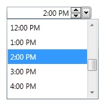

# TimePicker
Derives from Control

Represents a control that allows users to select a time. 

## Properties
|| Property || Description
| AllowSpin | Gets or sets a value indicating whether interacting with the spinner will result in increment/decrement operations.
| ClipValueToMinMax | Gets or sets if the value should be clipped when minimum/maximum is reached.
| EndTime | Gets or sets the last time listed in the control's dropdown.
| Format | Gets or sets the time format displayed.
| FormatString | Gets or sets the format string used when **Format** is set to Custom.
| IsOpen | Gets or sets a value indicating whether the dropdown is open.
| Kind | Gets or sets a value indicating whether a DateTime object represents a local time, a Coordinated Universal Time (UTC), or is not specified as either local time or UTC. NOTE: Setting this property fixes a bug where losing focus on the TimePicker was incrementing time in UTC. It also fixes a bug where specifying a UTC Date was changing the date's Kind property to UnSpecified or Local.
| MaxDropDownHeight| Gets or sets the maximum drop-down height of the popup of the TimePicker.
| Maximum | Gets or sets the Maximum allowed value.
| Minimum | Gets or sets the Minimum allowed value.
| ShowButtonSpinner | Gets or sets a value indicating whether the button spinner is shown.
| StartTime | Gets or sets the first time listed in the control's dropdown.
| TextAlignment | Gets or sets the alignment of the time picker's text.
| TimeInterval | Gets or sets the time interval between the TimeItem items listed in the dropdown.
| UpdateValueOnEnterKey | Gets or sets a value indicating whether the synchronization between "Value" and "Text" should be done only on the Enter key press (and lost focus). 
| Value | Gets or sets the DateTime value of the TimePicker.
| Watermark | Gets or sets the watermark to display in the control.
| WatermarkTemplate | Gets or sets the watermark template.

## Events
|| Event || Description
| ValueChanged | Raised when the **Value** changes.

**Support this project, check out the [Plus Edition](https://xceed.com/xceed-toolkit-plus-for-wpf/).**
---