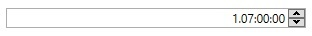

# TimeSpanUpDown
Derives from Xceed.Wpf.Toolkit.Core.Primitives.DatetimeUpDownBase

The TimeSpanUpDown controls let you increment or decrement a time over 24 hours. The Format is Days.Hours:Minutes:Seconds.

## Properties
|| Property || Description
| AllowSpin | Gets or sets the ability to perform increment/decrement operations via the keyboard, button spinners, or mouse wheel. (Inherited from UpDownBase)
| AllowTextInput | Determines if the editable part of the control can be edited. The editable part does not include buttons or spinners, it is typically the text part.
| ClipValueToMinMax | Gets or sets if the value should be clipped when minimum/maximum is reached. (Inherited from UpDownBase)
| DisplayDefaultValueOnEmptyText | Gets or sets if the **DefaultValue** should be displayed when the **Text** is empty. (Inherited from UpDownBase)
| DefaultValue | Get or sets the value to use when the **Value** is null and an increment/decrement operation is performed. (Inherited from UpDownBase)
| FractionalSecondsDigitsCount | Gets or sets the number of digits to use to represent the fractions of seconds in the TimeSpan.
| Maximum | Gets or sets the maximum allowed value. (Inherited from UpDownBase)
| Minimum | Gets or sets the minimum allowed value. (Inherited from UpDownBase)
| MouseWheelActiveTrigger | Gets or sets when the mouse wheel event should affect the value. (Inherited from UpDownBase)
| ShowButtonSpinner | Gets or sets if the button spinners are visible. (Inherited from UpDownBase)
| UpdateValueOnEnterKey | Gets or sets a value indicating whether the synchronization between "Value" and "Text" should be done only on the Enter key press (and lost focus). (Inherited from UpDownBase)
| Value | Gets or sets the numeric value. (Inherited from UpDownBase)
| CultureInfo | Gets or sets the current CultureInfo. (Inherited from InputBase)
| IsReadOnly | Gets or sets a value indicating whether the control is read only. (Inherited from InputBase)
| Text | Gets or sets the formatted string representation of the value. (Inherited from InputBase)
| TextAlignment | Gets or sets the alignment of the Text. (Inherited from InputBase)
| Watermark | Gets or sets the object to use as a watermark if the **Value** is null. (Inherited from InputBase)
| WatermarkTemplate | Gets or sets the DataTemplate to use for the Watermark. (Inherited from InputBase)

## Events
|| Event || Description
| ValueChanged | Raised when the Value changes. (Inherited from UpDownBase)
| InputValidationError | Raised when the Text cannot be converted to a valid Value. (Inherited from UpDownBase)

**Support this project, check out the [Plus Edition](https://xceed.com/xceed-toolkit-plus-for-wpf/).**
---