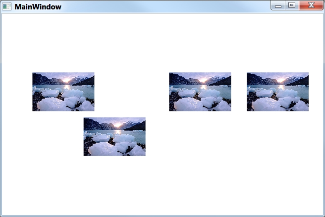

# TimelinePanel
Derives from Panel

TimelinePanel is a WPF panel that arranges its children along a timeline. Items are placed along the timeline based on the Date attached property, which is set on each item.

{{

        <xctk:TimelinePanel BeginDate="01/01/2007" EndDate="12/31/2007">
            <Image Margin="5,5,5,5" Width="100" xctk:TimelinePanel.Date="02/01/2007" 
                Source="C:\Windows\Web\Wallpaper\Landscapes\img8.jpg" />
            <Image Margin="5,5,5,5" Width="100" xctk:TimelinePanel.Date="03/31/2007" 
                Source="C:\Windows\Web\Wallpaper\Landscapes\img8.jpg" />
            <Image Margin="5,5,5,5" Width="100" xctk:TimelinePanel.Date="07/06/2007" 
                Source="C:\Windows\Web\Wallpaper\Landscapes\img8.jpg" />
            <Image Margin="5,5,5,5" Width="100" xctk:TimelinePanel.Date="10/02/2007" 
                Source="C:\Windows\Web\Wallpaper\Landscapes\img8.jpg" />
        </xctk:TimelinePanel>
}}

## UnitSize and UnitTimeSpan
These properties are used to determine how much space (UnitSize, in pixels) is used in the representation of an item on the TimelinePanel by each multiple of a given timespan (UnitTimeSpan). For example, on a TimelinePanel in which UnitSize is set to 5.0 (pixels) and UnitTimeSpan is set to 12 hours, an element that lasts 14 days (336 hours) would be 140 pixels wide:

* 336 / 12 = 28 intervals of 12 hours
* 28 * 5 = 140
These properties must be used in conjunction and with valid values for them to work properly.

## Properties
|| Property || Description
| BeginDate | Gets or sets the beginning date of the TimeLinePanel, which corresponds to the beginning or leftmost side of the TimelinePanel. The position of all items in the panel will be calculated relative to this date.
| CanHorizontallyScroll | Gets or sets a value indicating whether scrolling on the horizontal axis is possible.
| CanVerticallyScroll | Gets or sets a value indicating whether scrolling on the vertical axis is possible.
| Date (attached) | Gets or sets the Date of a children.
| DateEnd | This attached property can be set on items within the TimelinePanel to determine size allotted to an item within the panel. DateEnd is an optional property. If omitted, the item will need to have an explicit Width set on it. If set on an item, the width of the item will be determined by difference between the DateEnd and the Date property.
| EndDate | Gets or sets the end date of the TimeLinePanel, which corresponds to the end or rightmost side of the TimelinePanel. The position of all items in the panel will be calculated relative to this date.
| ExtentHeight | Gets a value that contains the vertical size of the extent.
| ExtentWidth | Gets a value that contains the horizontal size of the extent.
| HorizontalOffset | Gets a value that contains the horizontal offset of the scrolled content.
| KeepOriginalOrderForOverlap | Gets or sets a value indicating whether the original order of the children should be respected when items with the same begin and end date overlap.
| Orientation | Gets or sets the orientation of the timeline (Horizontal or Vertical).
| OverlapBehavior | Gets or sets the behavior of overlapped items (Stack, Stretch, Hide, None).
| ScrollOwner | Gets or sets a value that identifies the container that controls scrolling behavior in the panel.
| UnitSize | Gets or sets the unit size (e.g., in pixels) to use in the timeline. Must be used in conjunction with UnitTimeSpan.
| UnitTimeSpan | Gets or sets the unit timespan to use in the timeline. Must be used in conjunction with UnitSize.
| VerticalOffset | Gets the vertical offset of the scrolled content. 
| ViewportHeight | Gets the vertical size of the viewport for this content.
| ViewportWidth | Gets the horizontal size of the viewport for this content.

**Support this project, check out the [Plus Edition](https://xceed.com/xceed-toolkit-plus-for-wpf/).**
---