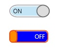

# ToggleSwitch
_Only available in the Plus Edition_

Derives from Control

The ToggleSwitch control is a fully customizable on/off switch that can be used to enhance the UI experience.

## Properties
|| Property || Description
| IsChecked | Gets or sets if the ToggleSwitch is currently checked.
| IsCheckedLeft | Gets or sets if the Checked value is on the Left side.
| CornerRadius | Gets or sets the radius of the corner of the toggleswitch
| OuterMargin | Gets or sets the OuterMargin of the ToggleSwitch.
| InnerMargin | Gets or sets the InnerMargin of the ToggleSwitch.
| CheckedContent | Gets or sets the Checked Content.
| CheckedTooltip | Gets or sets the Checked ToolTip.
| CheckedForeground | Gets or sets the Brush for the Foreground of the Checked content.
| CheckedBackground | Gets or sets the Brush for the Background of the Checked content.
| UncheckedContent | Gets or sets the Unchecked Content.
| UncheckedTooltip | Gets or sets the Unchecked ToolTip.
| UncheckedForeground | Gets or sets the Brush for the Foreground of the Unchecked content.
| UncheckedBackground | Gets or sets the Brush for the Background of the Unchecked content.
| ThumbHeight | Gets or sets the Height of the Thumb. A value of 0 will set the Thumb's height to ToggleSwitch.ActualHeight. Default is 0.
| ThumbWidth | Gets or sets the Width of the Thumb.
| ThumbElasticity | Gets or sets the Elasticity of the Thumb.
| ThumbLeftContent | Gets or sets the Thumb's Content Left side.
| ThumbRightContent | Gets or sets the Thumb's Content Right side.
| ThumbForeground | Gets or sets the Brush for the Foreground of the Thumb.
| ThumbBackground | Gets or sets the Brush for the Background of the Thumb.
| ThumbBorderBrush | Gets or sets the Brush for the Border of the Thumb.
| ThumbBorderThickness | Gets or sets the BorderThickness of the Thumb.
| ThumbHoverBackground | Gets or sets the Brush for the Background of the Thumb Hover.
| ThumbHoverBorderBrush | Gets or sets the Brush for the BorderBrush of the Thumb Hover.
| ThumbPressedBackground | Gets or sets the Brush for the Background of the Thumb Pressed.
| ThumbPressedBorderBackground | Gets or sets the Brush for the BorderBrush of the Thumb Pressed.
| ThumbStyle | Gets or sets the style to use for the thumb in the ToggleSwitch. When this property is null, the following properties will be used in the ToggleSwitch: ThumbLeftContent, ThumbRightContent, ThumbForeground, ThumbBackground, ThumbBorderBrush, ThumbBorderThickness, ThumbHoverBackground, ThumbHoverBorderBrush, ThumbPressedBackground, ThumbPressedBorderBrush. If this property is not null, these properties won’t be used. Default is null.

## Events
|| Event || Description
| IsCheckedValue | Raised when the IsChecked property changes
| IsCheckedLeftValue | Raised when the IsCheckedLeft property changes
---