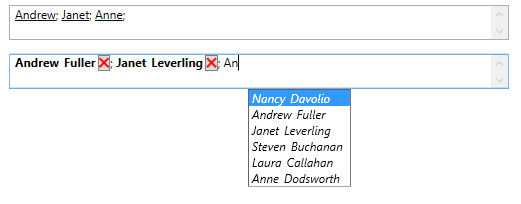

# TokenizedTextBox
_Only available in the Plus Edition_

Derives from Xceed.Wpf.Toolkit.Primitives.Selector

Represents a textbox control that lets you edit and display a series of values as tokens. If an ItemsSource is specified, an AutoComplete popup will appear with a filtered list of valid values during editing.

{{
        <xctk:TokenizedTextBox x:Name="_tokenizedTextBox"
                               TokenDelimiter=";"
                               DisplayMemberPath="LastName"
                               TokenDisplayMemberPath="FirstName"
                               SearchMemberPaths="FirstName,LastName"
                               ItemsSource="{Binding Path=EmployeeList}" />
}}

## Properties
|| Property || Description
| AllowDuplicateValues | Gets or sets if duplicate Tokens are allowed.
| AllowInvalidValues | Gets or sets if invalid values are allowed (i.e.: values not found in the ItemsSource if an ItemsSource is used).
| IsDropDownOpen | Gets or sets a value indicating whether the dropdown is open.
| IsValid | Gets or sets if the TokenizedTextBox is currently valid (if all the Tokens are found in the ItemsSource, if one is provided).
| ItemsSource | Gets or sets the ItemsSource. (Inherited from System.Windows.Controls.ItemsControl)
| MaxDropDownHeight | Gets or sets a value representing the maximum dropdown height.
| SearchMemberPaths | 	Gets or sets the field(s) used for filtering valid values (only string columns are considered).
| SelectedItem | Gets or sets the last checked or unchecked item. (Inherited from Xceed.Wpf.Toolkit.Primitives.Selector)
| SelectedItems | Gets the collection of checked items. (Inherited from Xceed.Wpf.Toolkit.Primitives.Selector)
| SelectedItemsOverride | Gets or sets a custom IList of selected items. (Inherited from Xceed.Wpf.Toolkit.Primitives.Selector)
| SelectedMemberPath | 	Gets or sets a path to a value on the source object used to determine whether an item is selected. (Inherited from Xceed.Wpf.Toolkit.Primitives.Selector)
| SelectedValue | Gets or sets a string containing the selected items separated by the value of Delimiter (ex., "Item1, Item2, Item3"). (Inherited from Xceed.Wpf.Toolkit.Primitives.Selector)
| Text | Gets or sets the Text string behind the TokenizedTextBox's content.
| TokenDelimiter | Gets or sets the Delimiter used to identify a Token.
| TokenDisplayMemberPath | Gets or sets a path to a value on the source object to serve as the visual representation of a selected token. If this value is null, DisplayMemberPath will be used as a fallback.
| TokenItemContainerStyle | Gets or sets the Style that is applied to the container element generated for each selected token.
| TokenItemTemplate | Gets or sets the DataTemplate used to display each selected token If this value is null, ItemTemplate will be used as a fallback.
| ValueMemberPath | Gets or sets the field used for the Token's ID. (Inherited from Xceed.Wpf.Toolkit.Primitives.Selector)

## Events
|| Event || Description
| QueryItemFromText | This event can be handled to extend the way a text input is converted to the corresponding item. Text input may be typed by the user or specified through the Text property. The query results have priority over the values underlined by the TokenDisplayMemberPath property.
| QuerySuggestItemForText | This event can be handled to extend the way a text input is considered to be a search match for an item. Search matches are displayed in the dropdown suggestion box. The query results have priority over the values underlined by the SearchMemberPaths property.
| QueryTextFromItem | This event can be handled to extend the way a token is converted to text for displaying, matching text, or for updating the Text property. The query result have priority over the values underlined by the TokenDisplayMemberPath property.
---